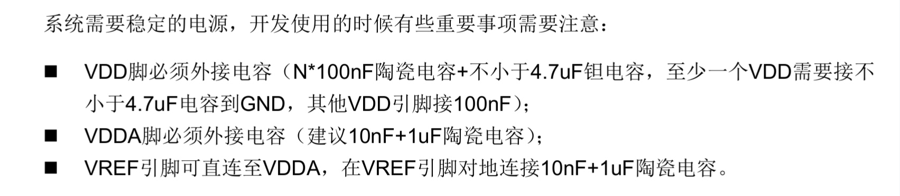
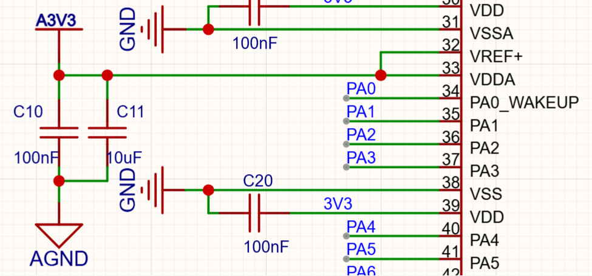
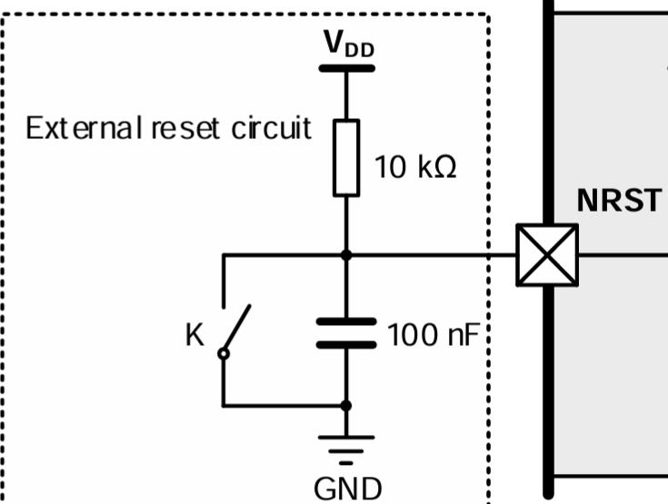
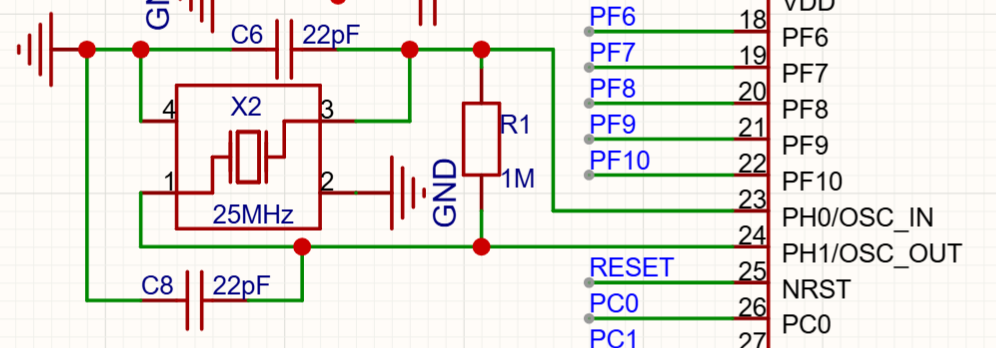
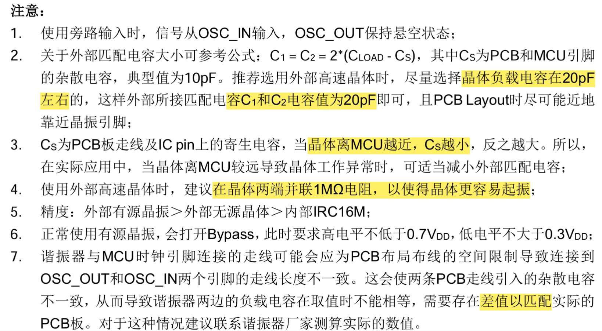
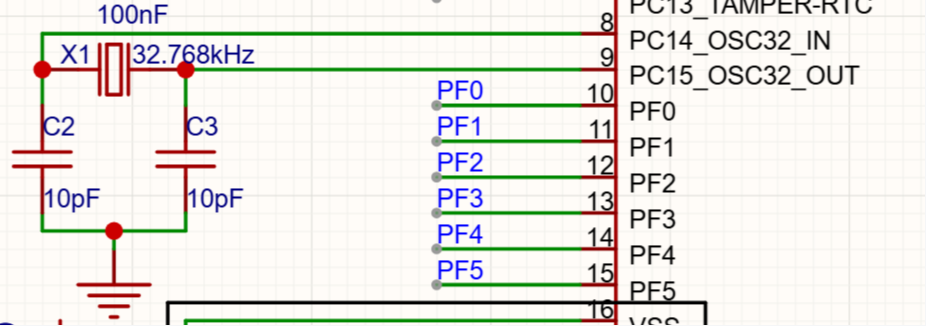
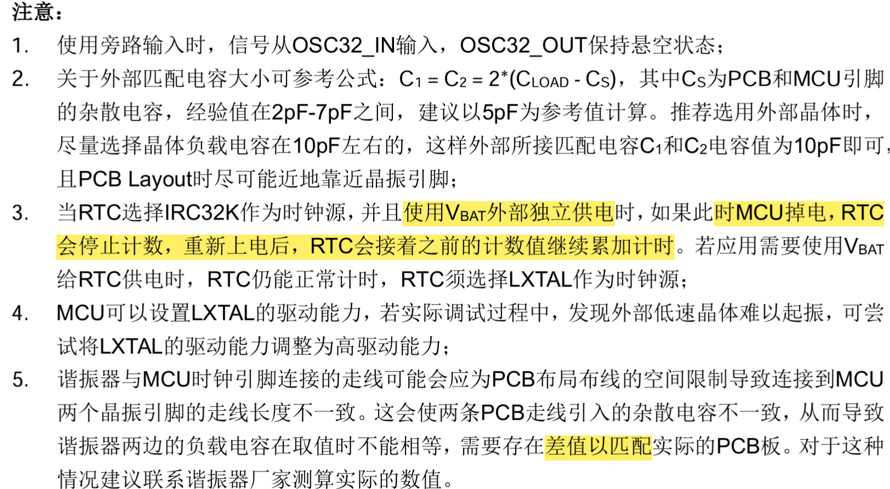
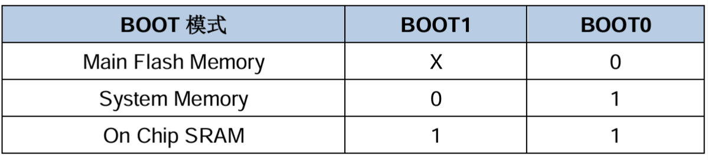
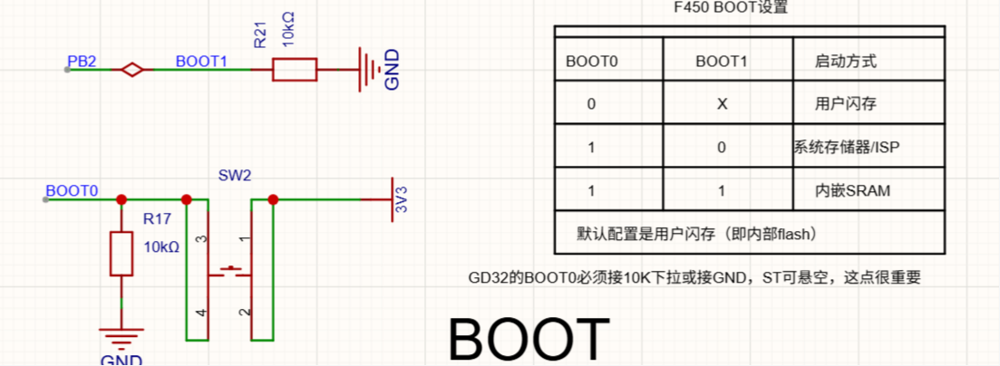
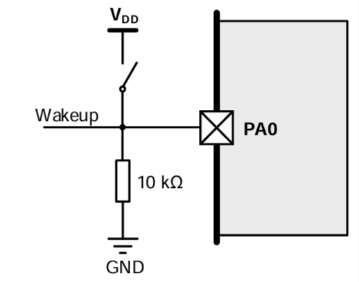

## 一、研究梁山派官方设计GD32F450ZGT6
### （一）官方设计参考与数据
一般官方的设计资料包含：
1. datasheet（数据手册），介绍芯片参数、性能、引脚标注、电气特性、机械结构等。
2. Reference Manual（参考手册），介绍内部外设工作原理。
3. User Manual / Application Note（应用笔记），官方设计经验，包含外部电路设计参考等。
4. 官方开发板原理图，完整实例。
### （二）芯片电源设计

- 根据手册的描述，应当采用10nf+1uf；但是在梁山开发板中选择了100nf+10uf的设计。
原因：1. 开发板的工作环境比较差，需要经常插拔电源，供电不一定稳定，更大的电容意味着更大的储能，抗电压变化能力更强。  2.Vref作为参考电压，关系到内部某些精密器件的工作，比如ADC，更小的电容，反馈更快，精度会更高。
- 开发板上没有使用4.7uf或10nf的钽电容。
原因：1.猜测是性能上来讲，开发板的负载不会很大，而且比较固定，因负载而产生电压动态响应的情况不大，100nf足以应付。因此如果测试可以，也可以不添加这个电容。  2.钽电容比较贵，控制成本。
### （三）复位与电源管理
- POR/ PDR（上电/掉电复位）电路，POR在该芯片中集成在芯片内部不对外暴露，上电时会自动工作，PDR对外暴露引脚PDR_ON。两个电路都是默认低电平复位。推荐PDR_ON引脚电路添加10k的上拉电阻。
- NRST复位电路，典型的外部复位电路设计。

### （四）时钟
- 外部高速时钟

上图为梁山派的设计，采用了25MHZ的方案。可以看到明显没有采用手册的推荐值，晶振的参数比较敏感，参数设计与pcb布线、线长、MCU、晶振设计都有关系，所以实际上参考公式（C=2*（Cload-Cs））只做参考，这一部分的数据还是经过测试验证最为妥当。
- 外部低速时钟

### （五）启动配置

### （六）唤醒电路
- 唤醒电路是低功耗模式的一环，在低功耗模式下，会配置唤醒源为唤醒电路的外部中断。
- 从Standby模式唤醒可通过WKUP引脚上升沿唤醒，此时无需配置对应GPIO，仅需配置PMU_CS寄存器里的WUPEN位即可。

- 注意，WKUP引脚至VDD间如果有串电阻，可能会增加额外的功耗。为了降低功耗可以将10k电阻换更大。