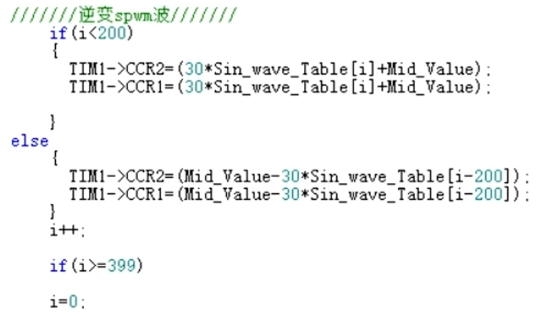
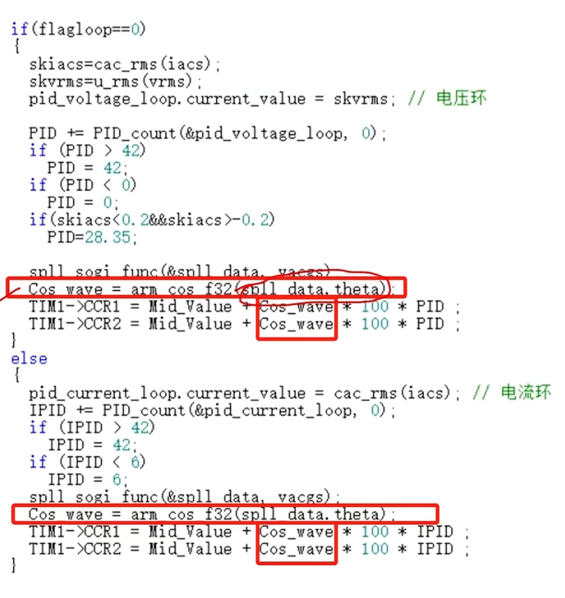
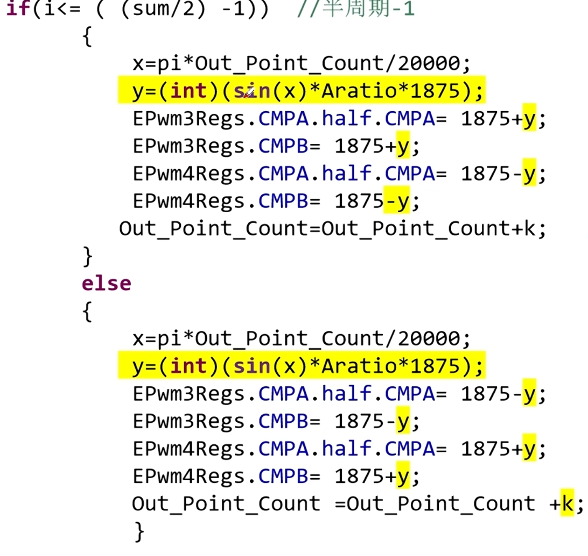
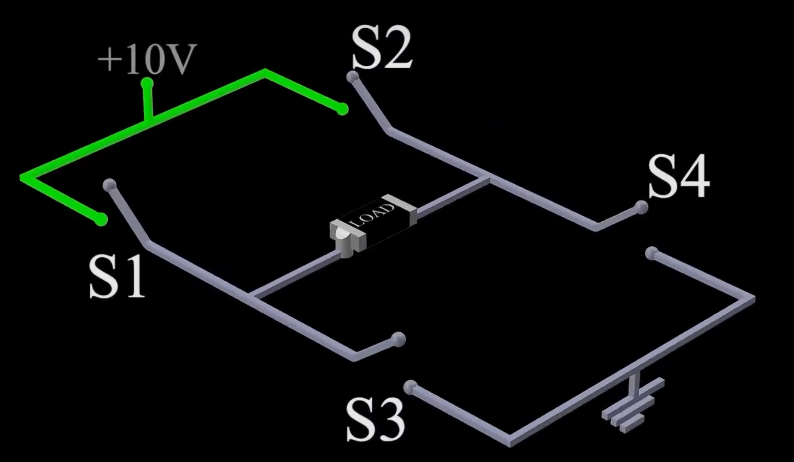
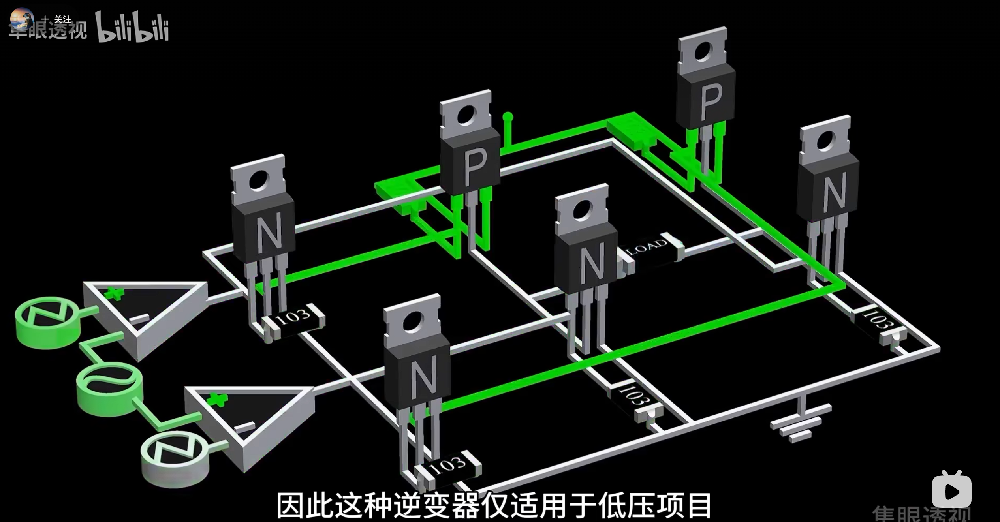

# 一、软件设计
单相全桥逆变器采用双闭环控制：电流内环（主电路电流）、电压外环（负载两端电压）。目标：通过*控制器*调节*驱动信号*，使逆变器输出一个稳定的正弦交流电压。
核心模块：（1）目标值uref生成，（2）PI控制器，（3）SPWM调制波
## （一）目标值uref生成
生成正弦波形态的uref有两种方式：
1.查表法
- 将一个正弦周期的离散点储存在表中，之后让系统按照顺序进行读取。
- 参数：定时器的定时中断频率f1，目标正弦波的频率f2，需要的离散点在一个完整周期中的数量为：f1/f2，如果是半轴的数据表，除2即可。
- 在设计中，需要加入中间值参数。
2.sin函数计算法

# 二、逆变器的工作原理
由于电路中存在反向电压，因此需要添加桥式结构。
H桥：
- 通过四个开关切换输出端的电压极性。在高侧使用PMOS作为开关，在低侧使用NMOS管作为开关。在控制端的前级，可以添加一个MOS管用作非门，进而通过一个信号的高低电平就产生正反两种信号。

- 如果输入信号为正弦波，通过两组三角波与比较器进行比较实现调制。

