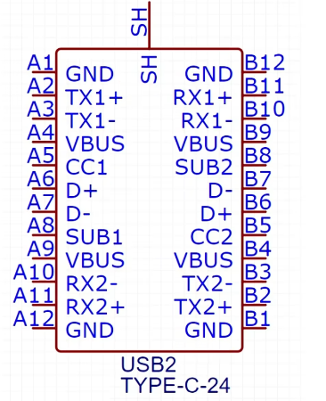

- ==同步整流与异步整流==：这里说的是buck电路的设计，在普通的buck电路拓扑中，为了在开关MOS管关闭时，给电感提供一个能量释放回路，会增加一个前级续流二极管，这样的结构称为异步整流电路。但是，二极管的导通时的存在0.7V较大的压降，耗能大。因此，将续流二极管换成MOS管，只有开关MOS管关闭时，这个MOS才打开，同时因为MOS导通时DS内阻小，因此效率更高。
- ==TYPEC接口协议与外围电路设计==：以最复杂的24pin为例，6pin和16pin都是24pin的删减版。

1. 在设计中，左右两侧是中心对称的，左右各自成一套完整的线路。因此在使用上，TYPEC可以不区分正反使用。
2. 引脚介绍：（1）VBUS——电源正极，电源的输入端；（2）D+，D-（部分也标注为DP+、DM-）——USB2.0协议的差分信号线；（3）TX1，TX2——USB3.0通讯信号；（4）CC1，CC2——配置通道，功能为识别正反插，以及电压等信息同步；（5）SUB1，SUB2——边带使用，传输非USB信号，如音频信号。
3. 外围电路设计：（1）通常下，CC1，CC2分别接5.1K电阻下拉到地。
