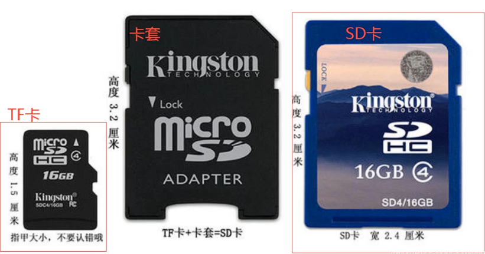

## 同步整流与异步整流
这里说的是buck电路的设计，在普通的buck电路拓扑中，为了在开关MOS管关闭时，给电感提供一个能量释放回路，会增加一个前级续流二极管，这样的结构称为异步整流电路。但是，二极管的导通时的存在0.7V较大的压降，耗能大。因此，将续流二极管换成MOS管，只有开关MOS管关闭时，这个MOS才打开，同时因为MOS导通时DS内阻小，因此效率更高。
## TYPEC接口协议与外围电路设计
以最复杂的24pin为例，6pin和16pin都是24pin的删减版。

- 在设计中，左右两侧是中心对称的，左右各自成一套完整的线路。因此在使用上，TYPEC可以不区分正反使用。
- 引脚介绍：（1）VBUS——电源正极，电源的输入端；（2）D+，D-（部分也标注为DP+、DM-）——USB2.0协议的差分信号线；（3）TX1，TX2——USB3.0通讯信号；（4）CC1，CC2——配置通道，功能为识别正反插，以及电压等信息同步；（5）SUB1，SUB2——边带使用，传输非USB信号，如音频信号。
- 外围电路设计：（1）通常下，CC1，CC2分别接5.1K电阻下拉到地。
## BUCK电路的器件选型计算

## 负片
- 指的是图片中表达的和实际完全相反，在pcb中图形中，就是什么地方有绘制，实际生产出来该地方就是空的。
- pcb中的负片一般说的都是vcc和gnd层。
## 封装设计规范
### 1.单位
普遍采用公制单位（mm），但是从公制向英制转换有误差，所以如果需要自己绘制封装，一般使用英制（mil）。
### 2.精度
mm为单位，精度为小数点后4位，mil为单位，精度为小数点后2位。
### 3.封装的基本组成
（1）焊盘  （2）丝印  （3）装配线【allegro】  （4）位号标识  （5）1脚标识  （6）安装标识 （7）占地标识【allegro】  （8）最大高度  （9）极性标识  （10）原点
## 焊盘的分类
- 规则焊盘：最常见的焊盘。
- 热风焊盘：（花焊盘）（十字焊盘），常见于负片中，有效减少散热面积，方便焊接。
- 隔离焊盘：==？存疑==
- 阻焊层：为了方便焊接，阻焊层绿油会开窗比焊盘大2.5mil。
- 钢网层：（锡膏层），开钢网焊接时使用。
## 丝印与位号的设计规范
- 标准单位：mil
- 常用尺寸如下：

| 线宽  | 字长  | 字高  |
| --- | --- | --- |
| 4   | 25  | 20  |
| 5   | 30  | 25  |
| 6   | 45  | 35  |
- 要求：（1）能够展示器件的方向、大小。有特殊形状、特殊安装方式的器件，需要标识。  （2）丝印与焊盘间距6mil以上。  （3）一脚标识：画圈  （4）极性
- 非金属化Keepout：一般是比孔径单边大5mil以上。
## keepout
- 指的是一段禁止区域
- 普通的keepout，包括禁止铺铜，禁止走线，禁止走线等。
- 非金属化keepout：禁止机械结构-安装孔灯。
## 参考电压
常标注作：Vref。有Vref+/Vref-，或者标注Vrefp/Vrefn。
## SD卡
### 1.概念介绍
SD卡是一种热插拔存储设备，从体积上分类：标准SD卡、miniSD卡、MicroSD卡（TF卡）。TF卡通过卡套可以与SD兼容。

- SD卡上有一个写保护按钮，拨动打开后将锁定卡只能读，不能写。
### 2.引脚功能

| SD卡引脚名称  | SD模式 | SPI模式      |
| -------- | ---- | ---------- |
| DAT3/CS  | 数据线3 | CS（片选/从选）  |
| CMD      | 命令线  | MOSI（主出从入） |
| VSS1     | 电源地  | 电源地        |
| VDD      | 电源   | 电源         |
| CLK      | 时钟   | SCK（时钟）    |
| VSS2     | 电源地  | 电源地        |
| DAT0/DO  | 数据线0 | MISO（主入从出） |
| DAT1/IRQ | 数据线1 | 保留         |
| DAT2/NC  | 数据线2 | 保留         |

| MicroSD卡引脚名称 | 功能（SDIO 模式） | 功能（SPI 模式） |
| ------------ | ----------- | ---------- |
| DAT2         | 数据线 2       | 保留         |
| DAT3/CS      | 数据线 3       | 片选信号       |
| CMD/MODI     | 命令线         | MOSI（主出从入） |
| VDD          | 电源          | 电源         |
| CLK          | 时钟          | 时钟         |
| VSS          | 电源地         | 电源地        |
| DAT0/MISO    | 数据线 0       | MISO（主入从出） |
| DAT1         | 数据线 1       | 保留         |
### 3.电路设计规范
- 设计在板边，并且做ESD处理。
- 供电3v3。
- 单端走线，控制阻抗50欧。
- 时钟信号线与其他信号线要间隔20mil以上，在用空间的情况下最好包地。