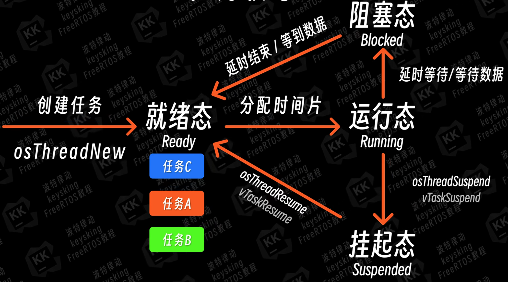

学习笔记来自00kino，学习老师包括：伟东山 bilibili，keysking bilibili。
# 一、使用STM32CUBEMX创建freertos工程
1. 先按照正常的创建流程创建工程，不一样的是，配置系统时钟-调试接口：serial wire，基准时钟需要选择一个定时器TIMX。

2. 配置freertos相关设置。


# 二、任务系统的创建与调度
项目目标：能够使用freertos创建任务。
1. 在freertos.c中创建一个初始化函数，默认创建了一个任务：defaultTaskHandle。

2. 谈CMSIS。
众所周知，stm32芯片的内核是由arm公司设计的，CMSIS就是arm官方编写的芯片内核调用的一套标准化软件接口规范，包括底层驱动文件软件架构、头文件、库模板。CMSIS为所有arm设计内核都提供了一套统一接口函数，如果需要编辑芯片内部的工作，只需要调用CMSIS的接口函数即可。RTOS本质就是一个系统内核调度系统，它的工作就是需要和芯片内核进行交互。目前，有很多的RTOS，例如FreeRTOS，RTThread等，他们各自有一套自己的系统调度函数，用法各不相同。为了保证使用的方便，在这些RTOS设计时，就保证了函数可以对接CMSIS的接口函数，进而完成相应功能。最终：你的代码 → CMSIS-RTOS2 → FreeRTOS → 硬件
3. 整个任务的函数调用流程。
以defaultTaskHandle为例，defaultTaskHandle<--osThreadNew(CMSIS文件)，其中osThreadNew是对xTaskCreate()的一层封装。
4. 关键函数与结构体的解释
```c
/// Create a thread and add it to Active Threads.
/// \param[in]     func          thread function.执行功能的函数
/// \param[in]     argument      pointer that is passed to the thread function as start argument.给功能函数传递的参数
/// \param[in]     attr          thread attributes; NULL: default values.任务属性结构体
/// \return thread ID for reference by other functions or NULL in case of error.返回值：如果执行成功：返回任务ID，失败：返回NULL
osThreadId_t osThreadNew (osThreadFunc_t func, void *argument, const osThreadAttr_t *attr);

// osThreadAttr_t 的定义（在 cmsis_os2.h 中） 
//常用字段：
|name|任务名（调试用）|"LED_Task"|
|stack_size|栈大小（**字节**，注意！）|512|
|priority|优先级|osPriorityNormal|
typedef struct 
{ const char *name; // 任务名称（调试用） 
uint32_t attr_bits; // 属性位（如 osThreadDetached） 
void *cb_mem; // TCB 内存（通常 NULL，让系统分配） 
uint32_t cb_size; // TCB 大小（通常 0） v
oid *stack_mem; // 栈内存（通常 NULL，让系统分配） 
uint32_t stack_size; // 栈大小（单位：字节）★ 
osPriority_t priority; // 优先级（osPriorityLow ~ osPriorityRealtime7）
TrustZone_ID tz_module; // TrustZone 相关（通常 0） 
uint32_t reserved; // 保留 
} osThreadAttr_t;

//FreeRTOS 原生的任务创建函数
BaseType_t xTaskCreate(
    TaskFunction_t              pxTaskCode,     // ① 任务函数
    const char * const          pcName,         // ② 任务名称
    const configSTACK_DEPTH_TYPE usStackDepth,  // ③ 栈深度
    void * const                pvParameters,   // ④ 任务参数(给任务函数的传参)
    UBaseType_t                 uxPriority,     // ⑤ 优先级
    TaskHandle_t * const        pxCreatedTask   // ⑥ 任务句柄（输出）
);

//将时间转换成系统节拍拍数函数
pdMS_TO_TICKS();      //参数为时间（单位ms）

//延时函数
vTaskDelay(pdMS_TO_TICKS(100));       //相对延时，从延时函数开始工作时刻起等100ms，无法保证什么时候跳出。
vTaskDelayUntil(&xLastWakeTime, pdMS_TO_TICKS(100)); //绝对延时，保证整个任务周期性清醒。
```
# 三、任务状态机
目标：了解任务的几种状态，状态之间是如何进行交换的。能够使用操纵任务状态的几个函数。
1. 任务状态：（1）ready，就绪态。创建的任务首先进入ready，之后，只要任务没有被执行，就会进入就绪态。（2）running，运行态。时间片流转，任务执行。（3）blocked，阻塞态。当任务被延时，或者设置后需要接收数据才能继续运行，任务就会blocked（4）suspended，挂起态。程序可以通过函数要求任务suspended，此时任务将不会再进入ready，直到再通过函数，让任务跳出suspended，进入ready。

2. 关键函数
```c
//任务的挂起与恢复
vTaskSuspend(xTaskHandle);           // 暂停某个任务
vTaskResume(xTaskHandle);            // 恢复某个任务
vTaskSuspendAll();                   // 暂停调度器（临界区用）
xTaskResumeAll();                    // 恢复调度器

// 删除任务
vTaskDelete(NULL);                   // 删除自己
vTaskDelete(xTaskHandle);            // 删除别人

// 优先级操作
uxTaskPriorityGet(NULL);             // 获取自己优先级
vTaskPrioritySet(NULL, 3);           // 修改自己优先级
```
3. 调试
Freertos创建任务后，会默认直接把优先级最大的任务直接挂到运行态。
4. 应用
```c
//使用暂停恢复调度器，对运算进行保护。
// ========== 加保护（安全） ========== 
vTaskSuspendAll(); // 暂停调度，谁都别想切进来 
X = 100; 
Y = 100; // 这两行一定连续执行完 
xTaskResumeAll(); // 恢复调度

```
# 四、队列
目标：理解队列的运行，了解freertos中队列的相关函数。
1. IPC机制
inter  process communication，进程间通信，也指任务间通信，用于不同任务/进程之间的数据传输与同步的机制。
```
  发送方任务               队列缓冲区              接收方任务
  ┌────────┐      ┌───┬───┬───┬───┬───┐      ┌────────┐
  │ Task A │ ───→ │ 1 │ 2 │ 3 │   │   │ ───→ │ Task B │
  └────────┘      └───┴───┴───┴───┴───┘      └────────┘
                        ↑    ↑    ↑
                      入队   队列   出队
                           满则阻塞
```
2. Queue队列
队列是freertos中最常见的IPC机制，具体是：创建一个链表或数组，A任务可以向其中写入数据，B任务可以读取其中的数据。
3. FIFO缓冲区
First In, First Out Buffer，先入先出。具体原理以及相关操作，请在数据结构与算法中学习，这里只需要知道，Queue就是一个典型的FIFO。首先被写入的数据，也会被首先读取出来。
4. 队列相关函数
```c
// 创建队列
QueueHandle_t xQueue = xQueueCreate(
    uxQueueLength,   // 队列能容纳多少个元素
    uxItemSize       // 每个元素的大小（字节），建议用 sizeof(xxx)
);

// 发送（三种方式）
xQueueSend(xQueue, &data, portMAX_DELAY);// 队列满则阻塞
xQueueSendToBack(xQueue, &data, 0);// 从尾部入队（= Send）
xQueueSendToFront(xQueue, &data, 0);// 从头部入队（紧急数据）

// 接收
xQueueReceive(xQueue, &data, portMAX_DELAY);// 队列空则阻塞

// 查询
uxQueueMessagesWaiting(xQueue);// 队列中还有多少数据
uxQueueSpacesAvailable(xQueue);// 队列还有多少空位
```
