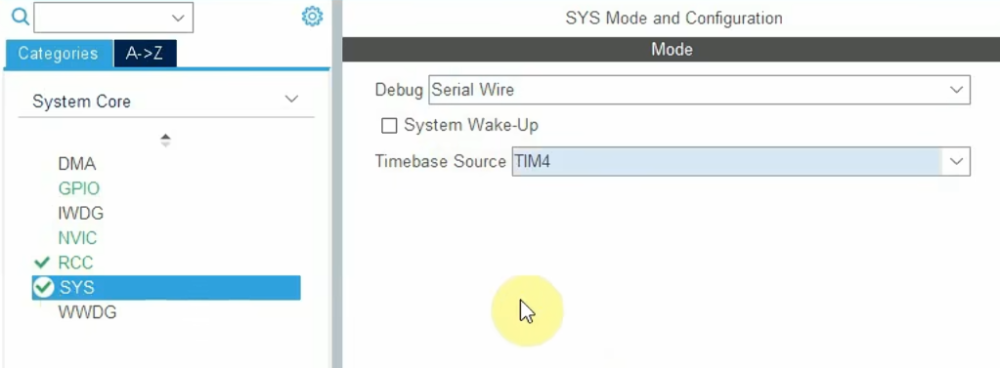
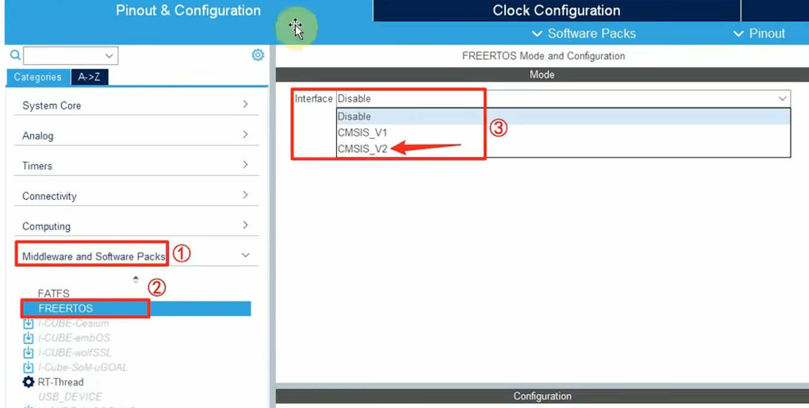
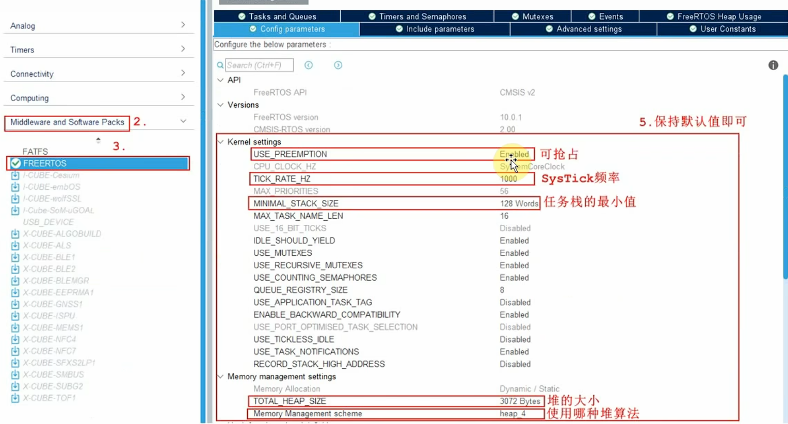
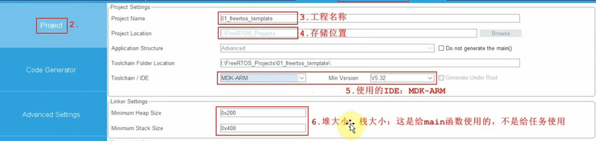
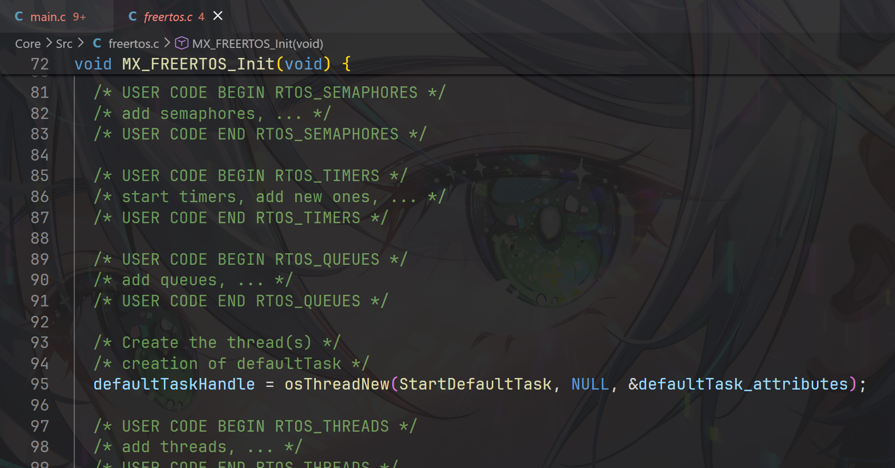

# 一、使用STM32CUBEMX创建freertos工程
1. 先按照正常的创建流程创建工程，不一样的是，配置系统时钟-调试接口：serial wire，基准时钟需要选择一个定时器TIMX。

2. 配置freertos相关设置。



# 二、创建一个freertos示例双任务程序
- 项目目标：使用freertos，实现两个完全不相关的任务的同时运行。
1. 在freertos.c中创建一个初始化函数，默认创建了一个任务：defaultTaskHandle。

2. 谈CMSIS。众所周知，stm32芯片的内核是由arm公司设计的，CMSIS就是arm官方编写的芯片内核调用的一套标准化软件接口规范，包括底层驱动文件软件架构、头文件、库模板。CMSIS为所有arm设计内核都提供了一套统一接口函数，如果需要编辑芯片内部的工作，只需要调用CMSIS的接口函数即可。RTOS本质就是一个系统内核调度系统，它的工作就是需要和芯片内核进行交互。目前，有很多的RTOS，例如FreeRTOS，RTThread等，他们各自有一套自己的系统调度函数，用法各不相同。为了保证使用的方便，在这些RTOS设计时，就保证了函数可以对接CMSIS的接口函数，进而完成相应功能。
3. 整个任务的函数调用流程。以defaultTaskHandle为例，defaultTaskHandle<--osThreadNew(CMSIS文件)
```c
/// Create a thread and add it to Active Threads.
/// \param[in]     func          thread function.
/// \param[in]     argument      pointer that is passed to the thread function as start argument.
/// \param[in]     attr          thread attributes; NULL: default values.
/// \return thread ID for reference by other functions or NULL in case of error.
osThreadId_t osThreadNew (osThreadFunc_t func, void *argument, const osThreadAttr_t *attr);

//func是osThreadNew的入口函数，
```