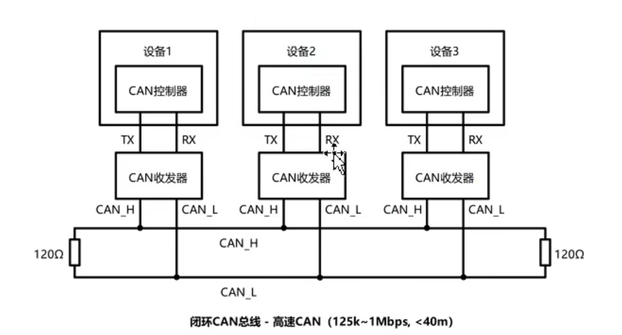
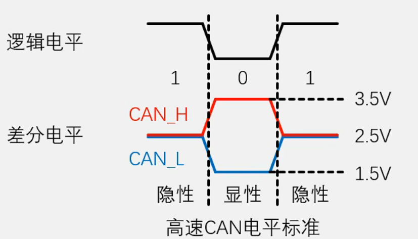
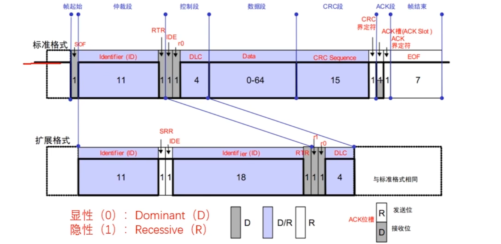

# 一、CAN协议特征
差分信号，异步，半双工。
# 二、CAN的物理电路
## （一）CAN通信的接线
CAN通信需要有CAN总线，其余所有的CAN通信设备都需要挂载在CAN总线上。设备的CAN控制器引出TX、RX，连接在CAN收发器上，CAN收发器会将TX、RX的信号转换成差分信号：CAN_H、CAN_L并连接在CAN总线上。
**注意**：在高速CAN中，CAN_H、CAN_L需要在端侧添加两个120欧的电阻进行阻抗匹配。

## （二）CAN的电平标准
CAN采用的是差分信号，即信号值=CAN_H-CAN_L。在高速CAN中，常见的电平标准是：0v-->1,2v-->0。默认状态下总线默认电平均为2.5v，拉高为3.5v，拉低为1.5v。
#### 显性隐形
在逻辑描述中，与常见的逻辑高电平为1相反，电压差为0为隐性电平，反之为显性电平。

# 三、帧格式

## 标准帧
+--------+--------+--------+--------+--------+--------+--------+--------+
| 帧起始 | 仲裁段  | 控制段  | 数据段  |  CRC   |  ACK   | 帧结束  |
|  1bit    | 12bit    |  6bit    | 0~64bit|  16bit  |  2bit   |  7bit     |
+--------+--------+--------+--------+--------+--------+--------+--------+
帧起始：拉低电平，表示后面的波形为传输的数据。
仲裁段：又称ID段，区分功能，以及确定信息的传输优先级。
控制段：包括RTR、IDE、r0、DLC。
	RTR：远程请求位，区分本帧信息是数据帧还是遥控帧。
	IDE：扩展格式标志位，用于区分标准格式与拓展格式。
	r0：预留升级拓展位。
	DLC：数据长度，指示后面的数据段是几个数据段。
数据段：1-8字节的有效数据。（高位先行）
CRC：冗余检验，检验数据是否正确。类似IIC的奇偶校验。
ACK：应答位。判断数据是否被接收。
帧结束：拉高电平，表示数据的传输结束。
## 拓展格式
在原先的控制段之前添加入新的总裁段。
SRR：替代RTR，在拓展格式下无意义。
## 遥控帧
遥控帧用于设备向指定ID地址的设备请求数据帧。替代设备直接广播数据帧，全员检测的模式。适用于交流不是很频繁或者时机不是很固定的模式。
如果本帧是遥控帧，RTR=1。且帧中不填充数据。
## 错误帧
总线挂载的所有设备都会检测数据的正确性，一旦检测到帧的数据错误，不论是位错误，CRC错误，应答错误等，设备就会发出错误帧来破坏数据，全部置0或1。这不遵循下述所说的位填充原则，也就是说，如果查看波形中确实有连续五个以上的相同电平出现，就说明这是错误帧。
## 过载帧
如果接收方难于招架发送方的信息发送速度，来不及处理信息等情况，接收方会发送过载帧，破坏数据帧，等待发送方重试发送数据，给接收方留出信息处理时间。
## 位填充
在帧中，如果出现连续5个以上时间片的高电平或低电平后，会强行填充一个相反电平。但是这并不会影响数据，接收方会对数据进行处理来恢复到原始数据。
原因：
1. 保持数据传输阶段的CAN总线活跃，避免被认为是空闲态而被其他设备使用总线。
2. 保证实时性，定期刷新电平边沿校准接收方的时钟信息，避免出现长数据的误解读。
3. 区分正常帧和（错误、过载帧）。
# 四、接收采样
发送方发送数据没有什么过多的讲究，但是接收方想要从CAN总线上精确的读出信息，需要我们做些设计考量。
问题主要在于时钟上，虽然双方约定了波特率，但是因为没有统一的时钟线，接收方将不知道何时进行采样才能采到正确的信息。比如过早或过晚采样采到错误信息，或者时钟不稳定误差积累采样逐渐偏离采样点。
CAN的解决方案是硬同步和再同步。
## CAN位时序
CAN对一个数据位bit进行了细分：SS、PTS、PBS1、PBS2。每一段都由若干时间片最小单位Tq构成。
SS：同步段。正常情况下的跳变沿所在段。
PTS：传播时间段。对传输延迟进行缓冲。
PBS：相位缓冲段。设置采样点的位置，采样点是1、2的中间，调整1、2的长度可以控制采样点的靠前靠后。
## 硬同步

