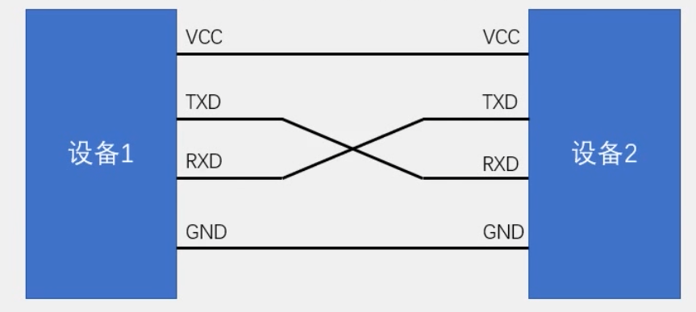

# 概述
UART，全称：Universal Asynchronous Receiver Transmitte，通用异步收发传输器。是一种全双工、异步的通信协议，特点是点对点。物理接线示例如下：

# 物理结构
常见有四根导线，vcc（电源正极）,txd（发送端）,rxd（接收端）,gnd（电源负极）。**注意**TX与RX需要交叉连接。
因为没有统一的时钟线，即异步通信，因此必须要共地，提供相同的电压基准。
# 帧格式
- 起始位：拉低 1 bit 时间，告诉对方"我要发数据了"
- 数据位：5~9 位，LSB 先发（最低位先发）
- 校验位（可选）：奇校验或偶校验
- 停止位：拉高 1~2 bit 时间，表示一帧结束
# 需要设置的参数
波特率：每秒传输的bit数量。常见有9600、115200等。
数据位：每帧中，有效数据的位数。最常用为8位。
停止位：一帧结束的标志。
起始位：一帧开始的标志。常用的设计方式是起始位为低电平，停止位为高电平。也就是说，在默认状态

# USART
