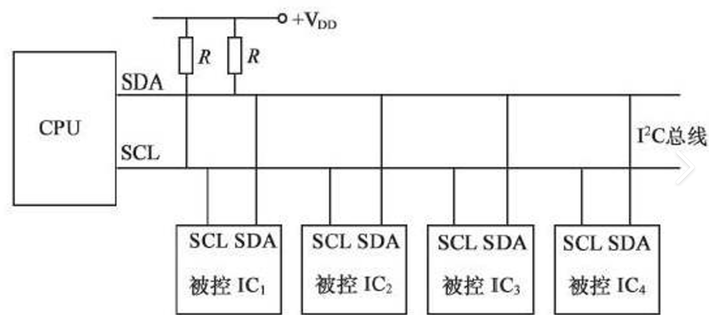

# 概述
IIC，全称为Inter‑Integrated Circuit，内部集成电路总线。同步、半双工的通信协议。可以单主机多从机，也可多主机多从机。单主机多从机的连接示意图如下：
 
# 物理结构与接线
在IIC协议下，每一个设备都要求通过SDA、SCL两条线路挂载在IIC总线上，所有设备的SDA、SCL分别连接。其中SCL是串行时钟线，SDA为串行数据线。
上拉电阻：对IIC总线的两条线都需要通过上拉电阻将总线电平上拉到VDD。原因为，保证在总线闲置情况下，总线电平默认为1，因为拉低电平到地的能力高于上拉，所以设备具有改变总线电平的能力。故设备能对总线进行的操作只有保持默认和拉低电平，保持默认电平为1，拉低电平则为0。
芯片的GPIO模式：通常采用开漏输出，因为引脚外部已经存在电源。
# 协议操作
- 起始位：要发送数据的设备拉低电平，总线其余所有设备获知要发送数据。
- 发送、接收信息：SCL低电平，A在总线上放置信息；SCL高电平，B从总线上读取信息。
- ACK应答位：发送方发送完一个字节数据之后，放开总线，总线回到高电平，可以被其他设备操作。接收方在接收完一字节数据后会接手总线，拉低电平1bit，告知主机已经接收，
- 终止位：总线重新回到长期高电平。
# 数据帧格式
## 发送数据
起始条件+地址+接收应答+数据+接收应答+……+结束条件
## 接收数据
起始条件+地址+发送应答+数据+发送应答+……+结束条件