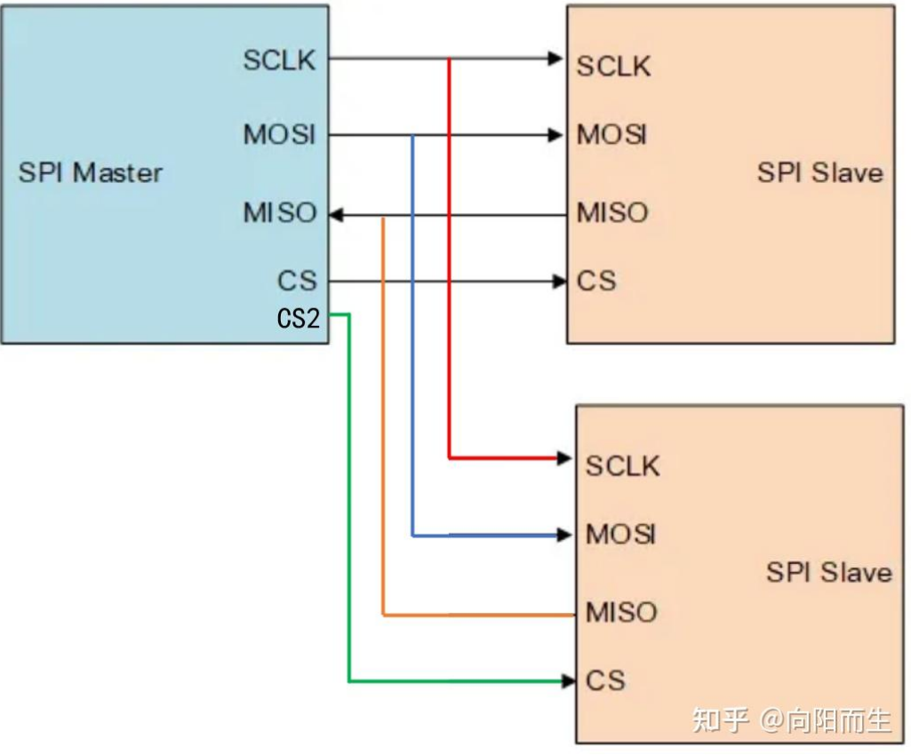

# 概述
SPI，全称为 Serial Peripheral Interface，串行外设接口。是一种同步、全双工的通信协议。采用一主多从的架构（不支持多主机）。连接示意图如下：

# 物理结构与接线
SPI 使用 4 根线（相比 I²C 的 2 根）：

|信号线|全称|方向|作用|
|---|---|---|---|
|SCLK|Serial Clock|主机 → 从机|串行时钟线|
|MOSI|Master Out Slave In|主机 → 从机|主机发送，从机接收|
|MISO|Master In Slave Out|从机 → 主机|从机发送，主机接收|
|SS/CS|Slave Select / Chip Select|主机 → 从机|片选信号（低有效）|

**关键区别**：
- I²C 是**半双工**（一根 SDA 分时复用），SPI 是**全双工**（MOSI/MISO 独立，可同时收发）
- I²C 通过地址寻址，SPI 通过 **SS 硬件片选线** 选择从机（每个从机独占一根 SS 线）
- SPI **没有上拉电阻**的要求，因为 MOSI/MISO/SCLK 都是推挽输出驱动，总线闲置时由主机保持电平
# 协议操作
### 1. 片选（SS）
- 主机拉低目标从机的 **SS 线**（低电平有效），选中该从机
- 未被选中的从机 MISO 引脚处于高阻态（不影响总线）
- 通信结束后，主机拉高 SS 线释放从机
### 2. 时钟极性（CPOL）与时钟相位（CPHA）
SPI 没有固定的边沿约定，而是通过两个参数配置，形成 **4 种工作模式**：

|模式|CPOL|CPHA|SCLK 空闲电平|采样边沿|
|---|---|---|---|---|
|0|0|0|低|上升沿采样，下降沿发送|
|1|0|1|低|下降沿采样，上升沿发送|
|2|1|0|高|下降沿采样，上升沿发送|
|3|1|1|高|上升沿采样，下降沿发送|
 主机和从机必须使用相同模式，否则数据错位！
### 3. 发送与接收同时进行
SPI 的核心机制：主机每发出一个时钟脉冲，主机和从机各通过 MOSI/MISO 同时移出 1 bit 数据。
这意味着：
- 主机想读从机数据，也必须发送数据（哪怕是 dummy 字节）来产生时钟
- 发送和接收在同一个 SPI 时钟周期内完成，真正的**全双工**
### 4. 没有 ACK 机制
与 I²C 不同，SPI **没有应答位**。主机不管从机是否准备好，直接发时钟收数据。这既是优点（快），也是缺点（不可靠，需要上层协议保障）。
## 数据帧格式
SPI **没有标准的数据帧格式**！帧结构完全由芯片厂商自定义。一般情况：
### 基本发送/接收流程
```
1. 主机拉低 SS → 选中从机
2. 主机产生 SCLK，同时通过 MOSI 发送数据、通过 MISO 接收数据
3. 每 8 bit / 16 bit 为一个传输单元（双方约定好的字长）
4. 主机拉高 SS → 释放从机
```
### 常见变体
- **命令+数据帧**：先发 1 字节命令（读/写+寄存器地址），再发/收 N 字节数据（如 Flash、传感器常见）
- **菊花链（Daisy Chain）**：多个从机的 MISO 串接到下一个的 MOSI，数据在一个长链中流转
---
## I²C vs SPI 对比总结

|特性|I²C|SPI|
|---|---|---|
|线数|2 根（SDA + SCL）|4 根（SCLK + MOSI + MISO + SS）|
|通信方式|半双工|全双工|
|速率|100k / 400k / 3.4M bit/s|无上限，常见 10M~50M bit/s|
|寻址方式|软件地址（7/10 bit）|硬件片选 SS|
|从机数量|受地址位限制（7bit→128 个）|受 GPIO 引脚数限制|
|应答机制|ACK / NACK|无（不可靠）|
|多主机|支持（带仲裁）|不支持|
|功耗|需上拉电阻，静态有功耗|推挽驱动，静态几乎无功耗|
|复杂度|协议较复杂|协议极简|

---

## 补充：Quad SPI / Dual SPI

在 SPI 基础上还有变体，通过复用更多数据线提升吞吐：

|模式|数据线条数|每时钟传输|
|---|---|---|
|标准 SPI|1发1收|1 bit|
|Dual SPI|2|2 bit|
|Quad SPI|4|4 bit|

常用于 NOR Flash 等需要高速读取的场景。