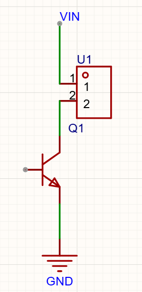
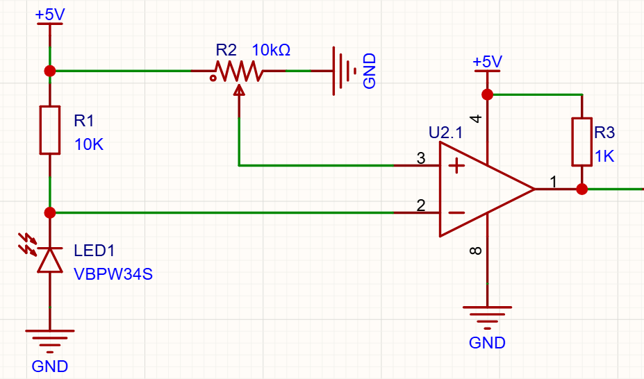
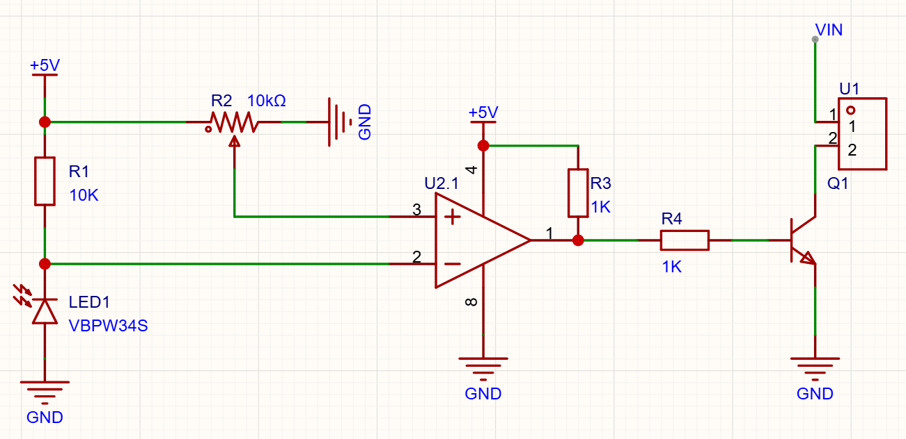

# 一、实现原理
通过硬件实现循迹小车，需要通过红外管检测小车是否到达黑线区域，检测到黑线，就控制对应电机的运动。
1.电机运动
	本项目设计中，小车只能单方向运动，因此对于电机的控制电路只需要控制电路的开关即可。

2.黑线检测
	红外接收二极管的工作：在没有接收到红外光时，二极管的反向电流很小，接收到一定强度的红外光之后，二极管就会反向导通。红外光强越强，电流越大。通过电流控制电路中的电压，当电压到达一定值后，发送控制信号。
3.参考电压
	因为实际电路没有那么理想，预计的正常工作时的电压可能并不是自己设计的值，因此参考电压的设计需要可变，根据实际情况进行调节。

最终实现结构简图。

# 二、改进电路
1.电机电路
因为电机为电感型器件，在电流突变时会产生高电压，因此需要添加一个续流二极管。
2.基极电阻
基极电阻控制了后级三极管的电流，如果三极管流过的电流较大，对与基极电阻的取值会比较敏感。（Ic>βIb）
已知使用的电机的正常工作电压为500ma左右，所以有：Ib=Ic/β。根据上图，R3和R4的取值为下值，如果总值相对较小，考虑到上拉电阻必须存在，可以只添加R3,而让R4=0。==R4不能不添加电阻，需要取0欧，因为实际非理想，需要预留电阻焊盘方便后期调试。==在实际调试中，最终的电阻取值越小越好，因为静态功耗更小。
$$
R3+R4=(5V-0.7V)/Ib
$$
3.稳定信号-电容
1. 在电机两端添加电容，滤除切换时的噪声。
2. 在电压输入端添加储能电容和滤波电容。（储能电容）
3. 在红外接收二极管所在电路上添加一个100pf的电容，滤除其上的高频信号。

