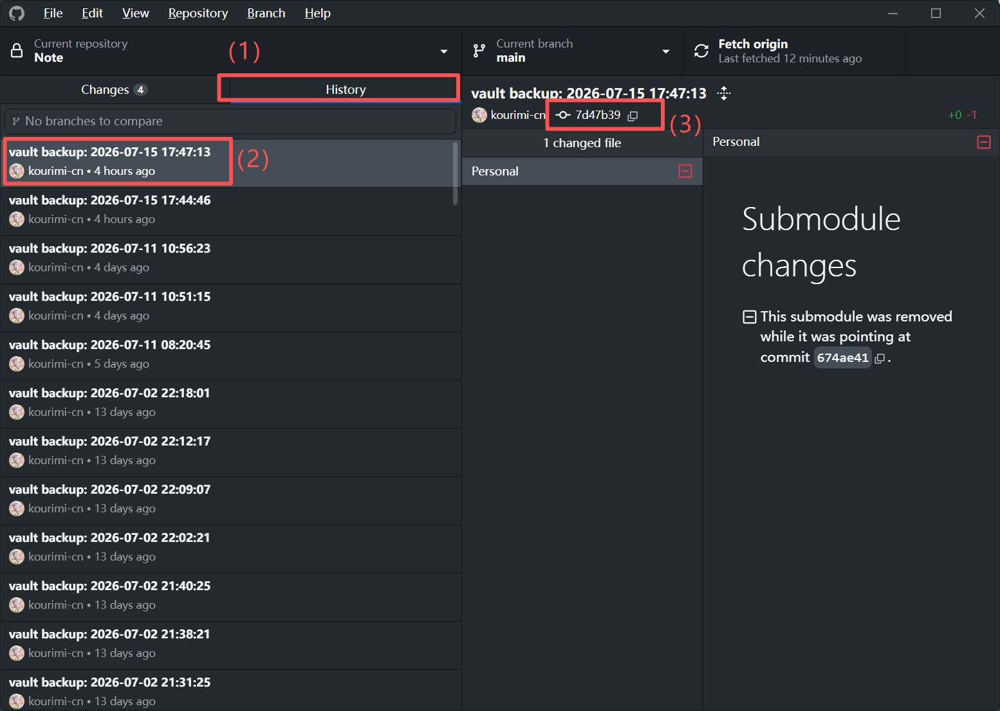

# 一、笔记介绍
- git的使用在代码管理中十分普遍，目前已经有需要的图形化操作界面，包括vscode中的git graph插件，软件github desktop等。但是，很多操作并没有在图形化界面中进行展示，因此我们并不能进行一些操作，这将极大的影响我们对于git的使用。
- 这篇笔记将持续更新本人在学习、使用过程中关于git的一些见解。
# 二、一些基本操作
## （一）git的版本回退
1. 应对情况：
- 在commit之后，我们需要将本地的内容回退到之前的版本，但是我们没有在git中进行版本隔离，这个情况就需要进行版本回退。
2. 操作：
- 在git仓库所在的本地文件夹（和.git同级）下打开命令行。
- 在指定地址打开命令行的操作：（1）打开文件夹，在上侧地址栏中输入cmd即可；（2）任意位置打开命令行，通过指令：cd 地址；（3）如果在指定位置打开，会在前面显示。
- 寻找git的版本储存地址：这个也有两种方式，（1）使用github desktop，按照下文图片的方式，找到所需要回复的版本的地址；（2）直接在github网页端进行操作，找到commit下中版本的地址。

- 注意：这里的地址被执行之后，版本会回退到这一个版本执行完之后，所以，按照你的设想，需要提前一个操作的地址。
- 在命令行中执行命令：git reset --hard 地址
