# 简介markdown
- Obsidian 是一款能力出众的笔记软件，所有内容均以 Markdown 格式保存。和日常使用的 Word 相比，Markdown 在程序员群体里受众更广 —— 它支持所见即所得，文件底层结构完全开放；但 Word 的内部存储机制不对外暴露，跨设备转换文件时经常出现各种无法预判的异常。
- 与此同时，Markdown 对 AI 更友好，文本可读性、可编辑性远优于其他格式。当我们需要和 AI 进行长篇、大量文字沟通时，用 Markdown 能有效提高 AI 输出内容的精准度。
- 单就记笔记而言，Markdown 条理分明、层级清晰，本身就十分适配笔记场景。
# 教程介绍
- 本教程目标为实现通过obsidian进行灵活管理笔记。笔记保存在本地，并且实现笔记实时上传到github，移动端拉取github内容实现移动端obsidian的笔记访问与修改。
# 一、PC端配置
## （一）建立github仓库
- 如果没有github账户，或者网络环境存在问题，这里并不进行赘述，请自行搜索材料进行配置。
- 在个人主页建立新的仓库。取名字。如果你要用作笔记用途，不想让github上别人看到自己的内容，请切换为私人仓库。其他保持默认即可。
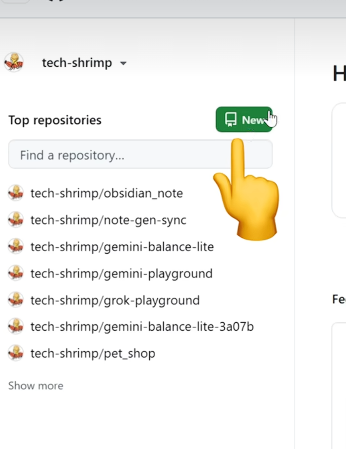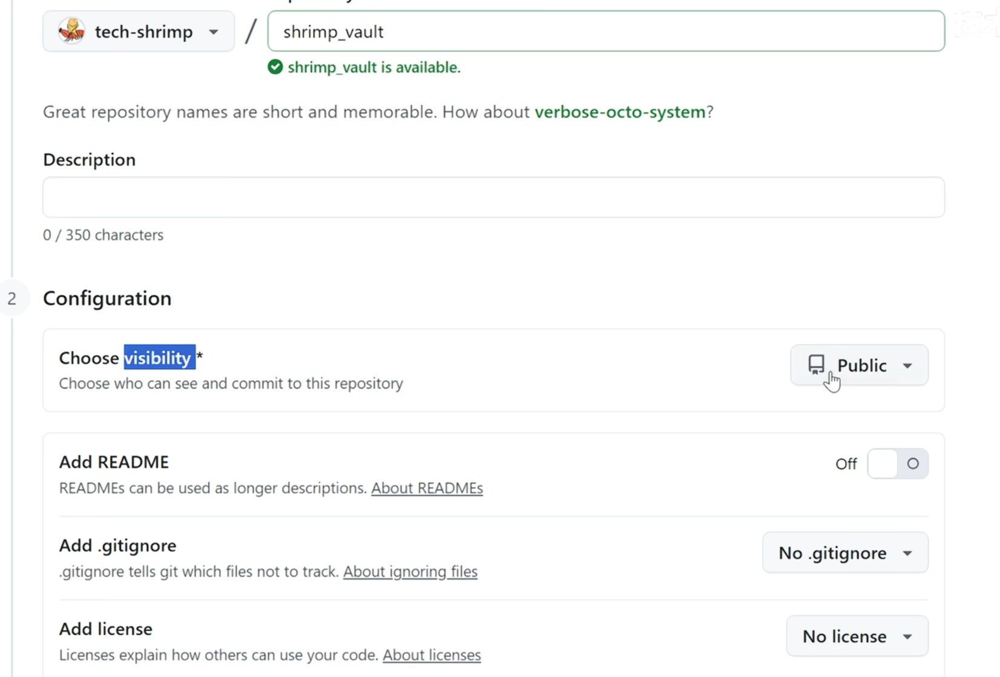
## （二）下载obsidian
官网链接：[Obsidian - Sharpen your thinking](https://obsidian.md/)
如果下载缓慢，请检查是否有科学上网环境。
## （三）obsidian配置
- obsidian打开本地仓库。因为笔记需要在本地保存，这里需要在磁盘上建立文件夹进行储存。因为只用作储存，推荐放在非c盘位置。
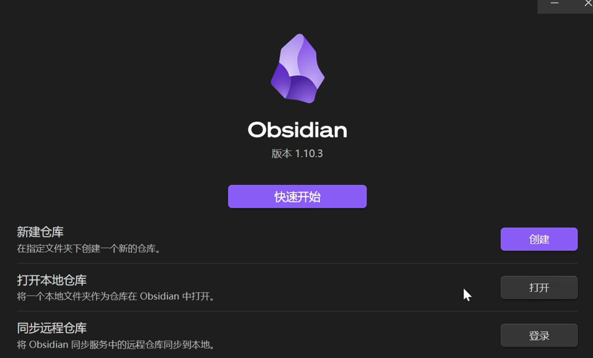
- 添加后，会发现文件夹中多了一些内容。软件使用中的配置文件储存在了.obsidian文件夹的json文件中。我们需要实现在本地进行工作时，不将工作区的工作状态上传到github，因为可能造成内容冲突，需要对文件进行修改。1.添加文件（.gitignore）;2.在该文件中写入：
```c
.obsidian/workspace.json 
.obsidian/workspace-mobile.json
```
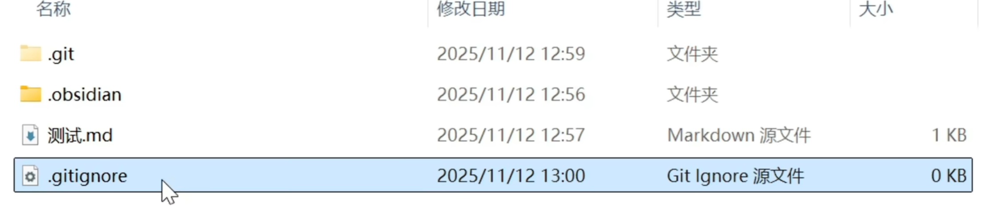
## （四）obsidian自动提交到github
- 这一步请在科学环境下进行。
- 点击齿轮（打开设置）
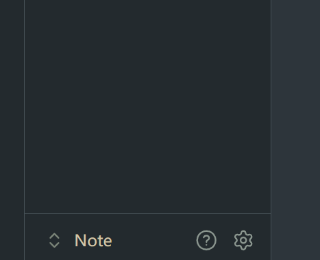
- 关闭安全模式
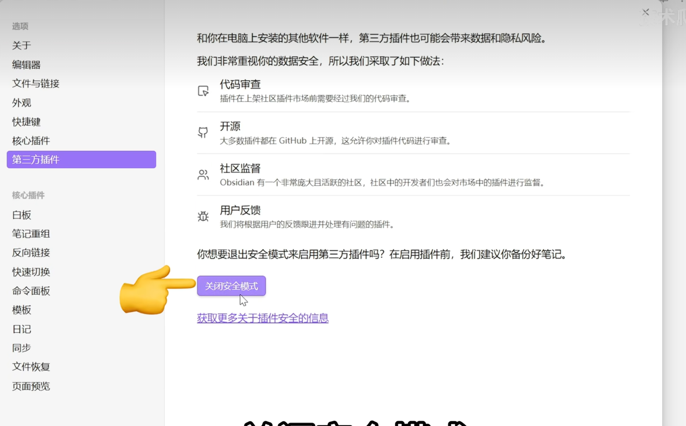
- 浏览插件市场
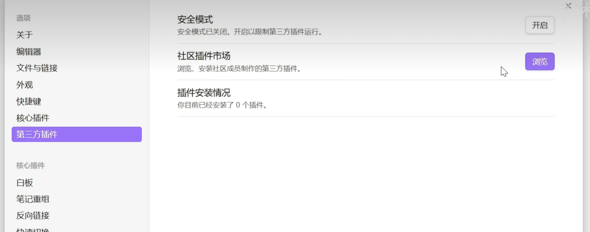
- 安装插件git，点击启用
- 注意，如果你的电脑中没有安装git，那么启用这个插件时大概率会报错git is not ready，请先安装git（git的安装请见后文）。或者，如果你的git没有安装在c盘可能也会报错，请在本地找到git.exe的地址填到Custom Git binary path选项。（如果你在使用github desktop，它是有一个git.exe的，请你填写它的路径。）可以用我的路径做参考：C:\Program Files\Git\cmd\git.exe。注意不要填到其他选项中。
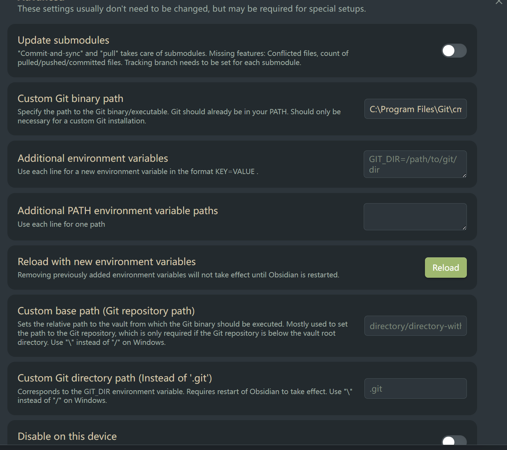
- 打开自动同步，修改自动同步时间，示例为停止编写1min后进行一次自动同步。


- 打开自动拉取，打开软件时，会自动拉取一次github仓库的内容并进行更新。

- 进行到这里你就可以进行同步测试了，因为软件本身的原因，实际上同步并不能完全即时，可能有1-2min的延迟。
## （五）使用markdown进行笔记记录
需要掌握一些基本的markdown编写规范，同时灵活运用右键调出工具栏。
【8分钟让你快速掌握Markdown】 https://www.bilibili.com/video/BV1JA411h7Gw/?share_source=copy_web&vd_source=9910a3255d94377d211ce5b297180bed
## (六)图片存储优化
- 如果你了解markdown，那你会知道，在该格式下，图片存储在一个图床中，在markdown笔记中显示的只是一个图片的地址链接，这将无法在github上直接显示，因此需要进行修改。
- 安装插件：custom attachment location，启用
- 修改url格式：assets/${noteFileName}/${genera tedAttachmentFileName}
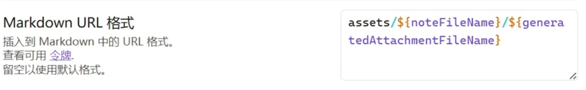
- 附件重命名模式：全部；是否重命名附件文件：是。
- 关闭使用wiki链接，内部链接类型为：基于当前笔记的相对路径。
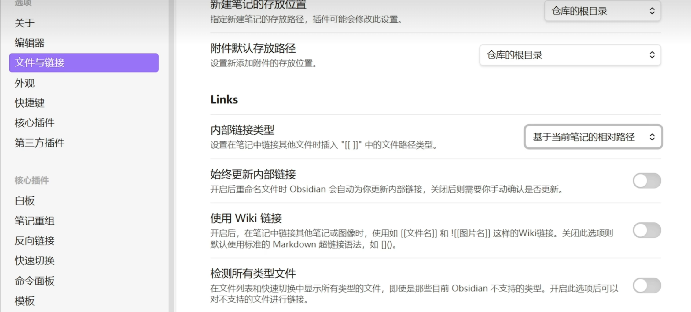
- 完成后，在笔记中粘贴图片，会在笔记的同级文件夹下创建一个assets文件夹，图片存储其中，同时可以在任意端打开，不会乱码。
# （二）移动端配置

## （一）安装移动端obsidian
- 这里我提供了一个下载链接，但是蓝奏云应该只能在电脑端打开并进行下载，请下载后转移到移动端进行安装。
```
https://wwboa.lanzouq.com/iabYO3u2u5qh  
密码:ci1y
```
## （二）转移核心文件
- 先在PC修改本地仓库访问git的方式，默认应该是SSH，需要修改为HTTPS访问，改好之后，把电脑上的本地文件拖到手机里（见下文）。再将电脑改回SSH。
- 注意，在移动文件时，不论是移动端还是PC端，请确保文件对应的软件是没有打开的，否则可能会有不可预知的错误。
- 在.git的同级下，右键打开gitbash。（需要安装git）
```
  输入
  git remote -v
  回复
  # 输出示例（SSH） 
  # origin git@github.com:xxx/xxx.git (fetch) 
  # origin git@github.com:xxx/xxx.git (push)
```
- 打开github网页仓库，点击上方绿色code，复制https的网址，在gitbash中修改，修改后关闭gitbash和obsidian。
```
输入
git remote set-url origin https://github.com/你的用户名/仓库名.git
验证
git remote -v 
# 输出 url 以 https:// 开头即完成
```
- 在手机文件目录下找到一个合适的文件夹，用于存放笔记文件。
- 将电脑上的整个笔记仓库复制到这个文件夹下。上面添加的（.gitignore）是这个文件夹的下一级文件。
- 在移动端打开obsidian，找到刚才的文件夹。一路选择允许，相信即可。
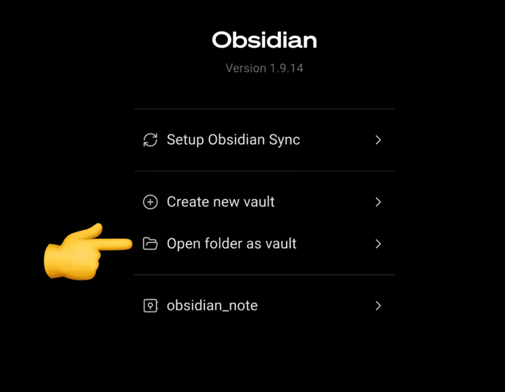
## （三）设置云同步
- 手机端左滑，右上角设置，可以切换语言。
- 下翻找到git插件，下翻，找到下图位置，在图中位置填写github昵称，还有github仓库账户使用的邮箱。
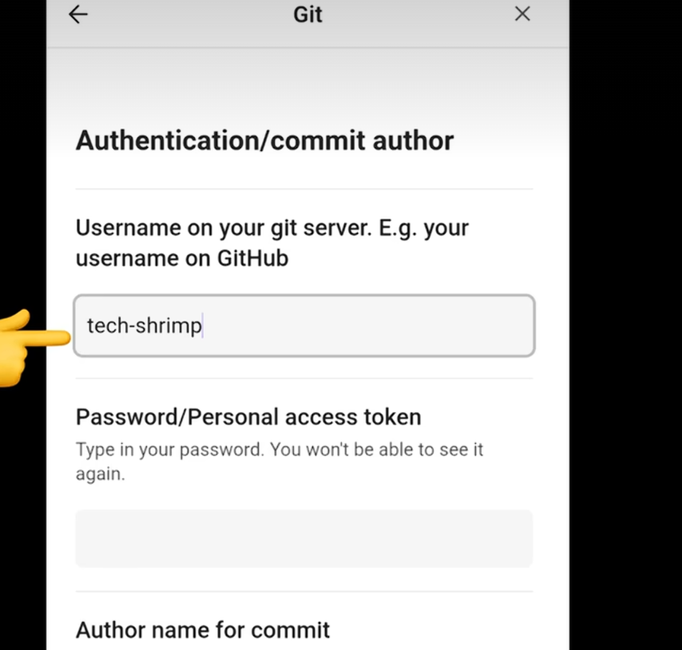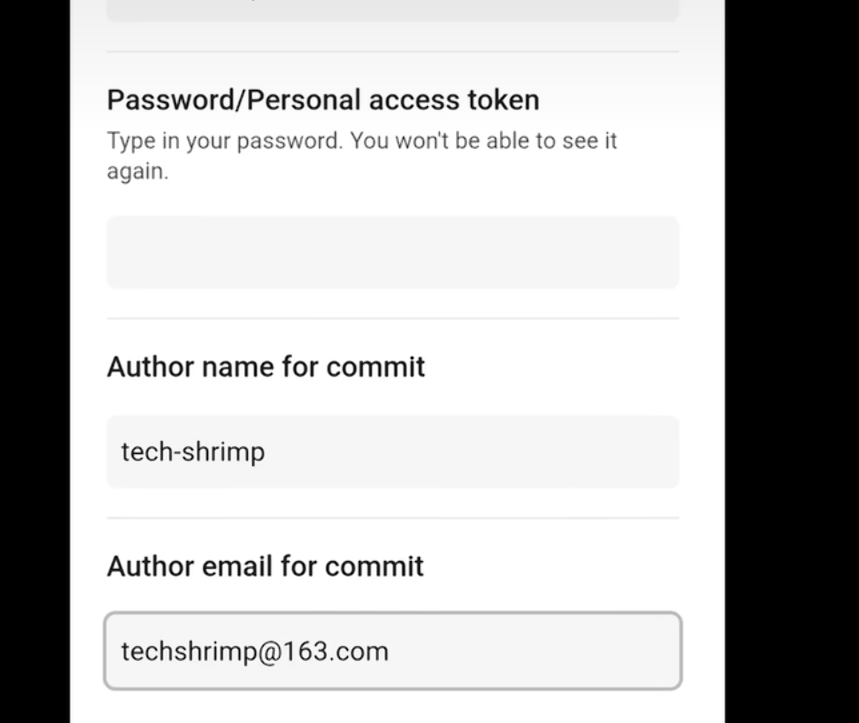
- 至此，配置完成。注意，由于软件原因，不推荐使用移动端修改，只建议作为查看。同时移动端同步github内容，至少5min后才会生效。
- 如果发现无法进行同步，有各种各样的报错，请确认是否按照要求进行了操作。
- 需要说明，如果要求登录github账户，这里名称就填github的名称，但是密码需要使用token秘钥。生成过程如下：1.github点击头像，点击设置；2.下翻找到开发者设置；3.点击tokens；4.添加新token，classic即可，名称随意，勾选上repo，生成秘钥。