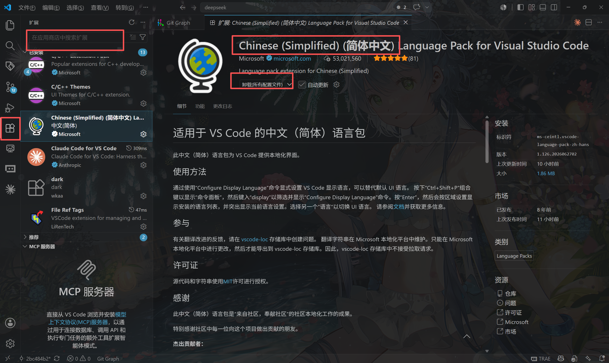
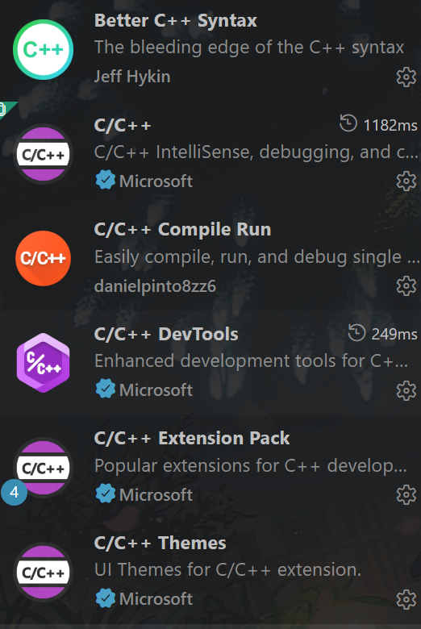
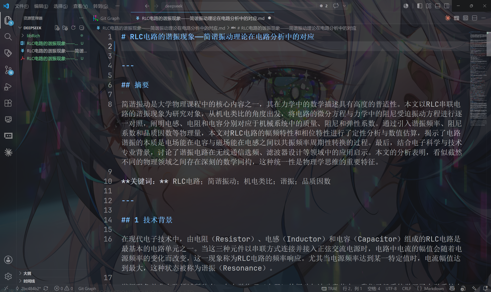
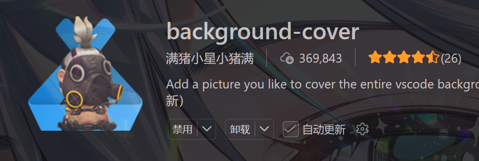
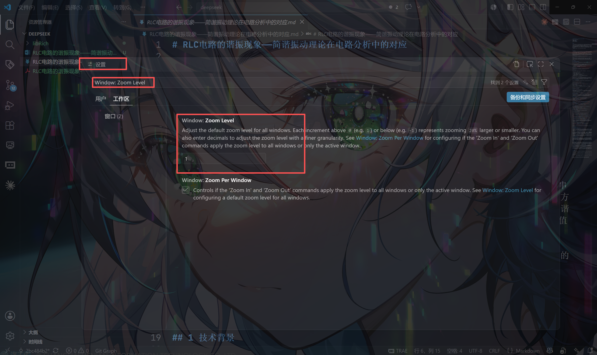
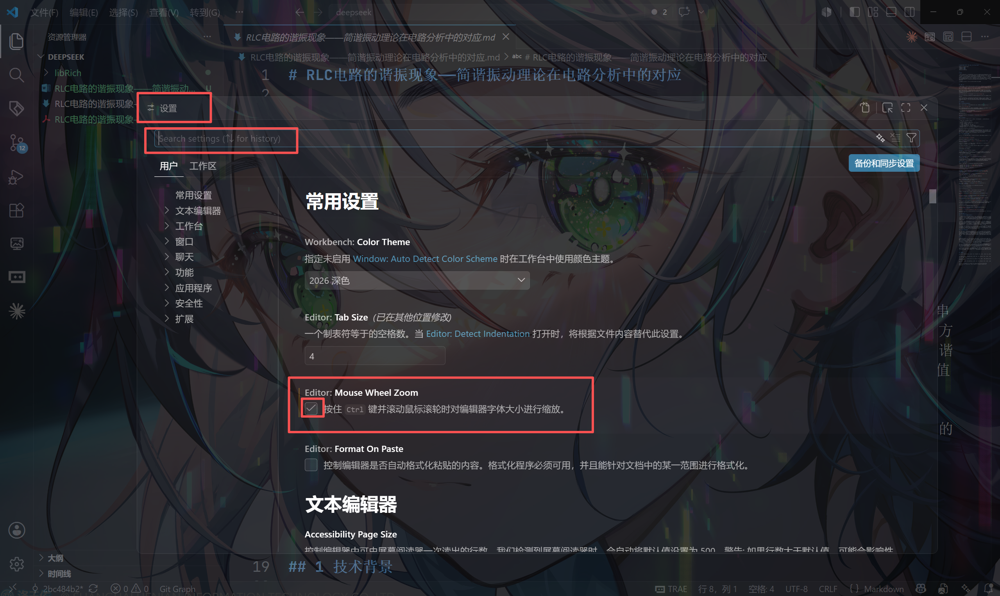
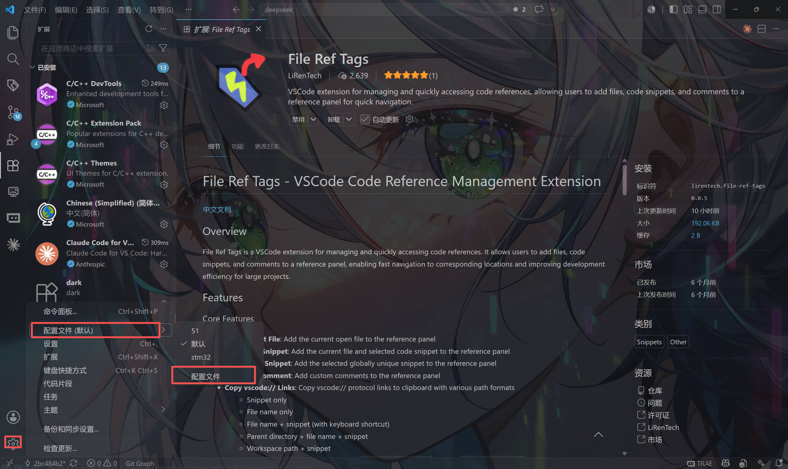

本笔记用于记录vscode软件的基本操作，一些常用设置，以及在vscode中配置cmake用于开发stm32的过程。
# 一、vscode软件的基本配置与优化。
## 1.安装中文拓展

在拓展界面搜索安装此拓展，如果界面没有切换成中文，那就关闭vscode，再重新打开。
## 2.基础c开发环境
由于本人专业的需求，绝大部分开发需要使用c/c++语言，需要安装一些关于c语言的拓展，具体如下。如果c只是你经常使用的语言之一，那在这里暂时不要安装拓展，具体看后面关于版本隔离部分。

## 3.背景美化插件
你的vscode背景一定是黑漆漆的，如果你喜欢这样，那就保持它，如果你觉得有点丑，想变成下面图片我的这样，那就安装这个插件。

## 4.工作区设置
### 工作区界面的比例
由于电脑屏幕的原因，你可能觉得左侧区域的字体有点小，可以通过这个进行设置。

### 自由调整代码界面字体大小
打开这个之后，滚动滚轮就可以对代码区域进行随意放大。

# 二、一些方便优化推荐
## 插件File Ref Tags
如果你编写代码过程中，需要经常在几部分代码中进行来回跳跃，一旦代码量比较大，这个过程将会非常烦人。这个插件可以对某一行代码打上标签，点击标签列表就可以快速跳转到对应的代码位置。
## 字体jetbrains
这个字体是clion（另一个广受好评的代码编辑器）的默认字体，个人十分喜欢，相比于vscode原版，这个字体的英文更加圆润饱满，看起来很整齐。
# 三、版本隔离
vscode的其中一个强大的点就是它的环境隔离，我们可以只在这一个编译器中进行c、c++、java，python等的开发，但是配置他们的拓展往往都是不同的，如果全部添加在一起，难保不会发生冲突，同时如此混乱也会影响我们的开发。因此，我们就需要进行环境隔离，在需要的时候使用对应的环境进行开发。
在上面的第一点中，我说过，如果你不是想我一样主要使用c语言，那么你就需要进行环境隔离。
流程：1，打开配置文件菜单；2，新建配置文件；3，修改名称；4，修改内容，如果你已经习惯在默认选项中配置的内容（如果你没有进行多余的操作，前面的所有配置都是应用于默认的，包括工作区的设置），可以全部勾选来源默认。

# 四、git管理
# 五、cmake

