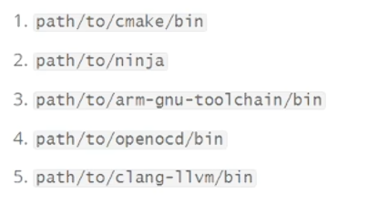
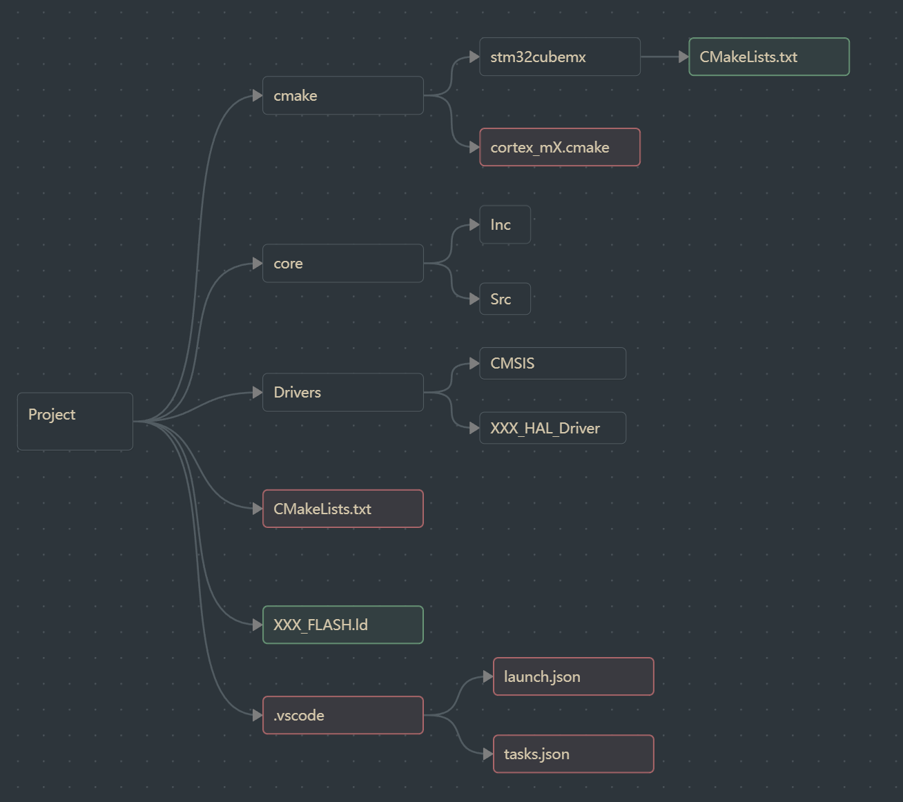

# 一、笔记介绍
本笔记内容是我学习bilibili网站up主ControlCoreX的笔记。主要讲解了在vscode中使用cmake进行stm32开发的环境配置。但是在后文中，00kino添加了自己的拓展内容。
随笔记链接一份模板工程，同样来自up主。链接如下：[DEMO文件](https://wwboa.lanzouq.com/i7u5A3xugqed)
# 二、介绍.vscode文件
在后续的设置中，我们会在工程的workspace中添加一个.vscode文件夹，里面包括launch.json、tasks.json、settings.json，通过这一部分的内容，我们可以设置IDE（vscode）与工程的交互。
1. workspace
在vscode中打开一个文件夹，软件就默认加载这个文件夹为workspace，会在该文件夹下生成一个workspace.json。
workspace就相当于其他编译器如keil的建立的工程项目。
2. settings
vscode提供了ui界面进行设置，同时也可以通过settings.json进行设置，在后续的操作中，需要通过settings.json进行设置。
settings的级别：settings有两个，分别是workspace的settings还有user的settings。user的settings是全局设置，workspace的settings针对的是这个工作文件，移植到其他项目的文件夹下同样会生效。workspace的settings优先级要高于user。
3. task
tasks.json是任务配置文件，一般配置编译、烧录等事件。通过task，开发者可以直接使用命令行指令，包括make，ninja，cmake等，无需打开终端进行操作。
4. launch
launch.json 是VSCode调试器的配置文件，里面会设置调试相关内容。
# 三、模板工程的使用
## （一）安装工具链
1. 下载工具链，建议放在d盘的一个专门用来放置环境相关文件的地方。包括：cmake，ninja，arm-gnu-toolchain，openocd，clangd
2. 将工具链添加进入系统环境变量。如何设置环境变量，请看自行查找。

3. 添加完成测试，在终端中查询版本号。如果可以出现版本号，证明前面步骤都是正确的。
```c
cmake --version
cmake version 3.28.1

ninja --version
1.11.1

arm-none-eabi-gcc --version
arm-none-eabi-gcc.exe (GNU Tools for STM32 13.3.rel1.20250523-0900) 13.3.1 20240614
Copyright (C) 2023 Free Software Foundation, Inc.
This is free software; see the source for copying conditions.  There is NO
warranty; not even for MERCHANTABILITY or FITNESS FOR A PARTICULAR PURPOSE.

openocd.exe --version
Open On-Chip Debugger 0.12.0 (2026-03-02) [https://github.com/sysprogs/openocd]
Licensed under GNU GPL v2
libusb1 d52e355daa09f17ce64819122cb067b8a2ee0d4b
For bug reports, read
        http://openocd.org/doc/doxygen/bugs.html

clangd.exe --version
clangd version 22.1.8 (https://github.com/llvm/llvm-project ca7933e47d3a3451d81e72ac174dcb5aa28b59d1)
Features: windows
Platform: x86_64-pc-windows-msvc
```
4. 添加新的环境变量，openocd，添加到与path平级的系统变量。命名必须是大写的SCRIPTS。

## （二）vscode拓展
在vscode中添加以下拓展。
- clangd（必须）
clangd的功能：代码补全，跳转到定义、查找引用，实时语法错误、警告标红等。clangd类似于微软 C/C++ 的扩展IntelliSense，但是更加轻量，如果习惯使用这个拓展的话，也可以不添加这个。
- CMake Language Support（必须）
为CMakeList文件服务，提供CMake 语法高亮，函数 / 变量补全等。
- Cortex-Debug（必须）
调试器。
- LinkerScript
提供`.ld/.lds` 链接脚本高亮。
- Material Icon Theme
提供资源管理器文件图标外观修改。
- Task Buttons（必须）
插件可以定义命令行功能按钮，并添加在vscode下方的状态栏中，这样，如果要执行代码构建、编译、烧录，就只需要点击按钮即可，不需要打开命令行再操作。
这个功能的执行需要tasks.json文件，具体文件内容在下文进行展示。
## （三）模板工程
适配芯片：STM32F407ZGT6
DEMO链接: https://pan.baidu.com/s/14EFUeQPD89I2WextZFJsxg?pwd=nbmp 提取码: nbmp
# 四、在配置中需要了解的专有名称
## （一）构建系统的层次
- 实际中项目的构建最底层是在编译器，但是直接操作编译器进行代码的开发非常麻烦，为了解决这个问题，创造了make工具。但是makefile的编写语法有些抽象，可读性比较差，因此就开发了cmake工具（cmakelist）。cmake工具是在make的更上一层的工具。
- 构建层次：cmake->make->编译器
## （二）MinGW
MinGW全称Minimalist GNU for Windows。GNU编译器只能在Linux上运行，通过MinGW，可以实现在Windows PC上运行编译器。此外还有arm编译器等，只能在单片机上运行。
MinGW中集成了make工具，在我们的开发环境中，下载MinGW实际上也就是为了使用这个make工具。
## （三）ninja
Ninja工具与make工具平级，Ninja的代码语法极其抽象，开发者难以阅读，因此必须依赖更高层级的工具的调用才能使用，相比之下，make工具语法会平易近人许多，所以说make可以直接使用。
- Ninja的设计是为了方便电脑阅读，设计的核心目的是为了更快的编译速度。
## （四）交叉编译器
在A上运行的编译器，编译出的结果文件运行在B平台上，这个编译器就是交叉编译器。例如：arm编译器。
## （五）clangd（llvm）
clangd是一个语法高亮提示工具，如果需要使用需要前后端两个部分。后端需要在工具链中下载clangd文件，前端需要在编译界面软件中添加插件。
# 五、cubemx的cmake移植
这里我以stm32f4xx芯片举例，在下文中，我会指出，不同的芯片具体应该如何进行配置。
1. cubemx的配置。
- 在project Manager中，设置toolchain/IDE为cmake，Default Compiler/Linker为GCC。
2. 了解cubumx生成hal库代码的文件结构。
- 结构如下图，红色标注为需要自己添加或者更改的部分。
- cmake文件夹下存放的是cmake编译相关的配置，包括gcc配置，clang配置，系统内核调用配置等。这里需要我们手动添加arm内核的调用配置cortex_mX.cmake。
- core文件夹中存放的是项目核心代码，自己添加的项目相关文件也可以放在这里，推荐在core的下级新建一个文件夹进行存放。Inc中存放HAL库的接口.c文件，Src中存放HAL库的接口.h文件。
- Drivers文件夹中存放的是底层文件，包括HAL库驱动以及CMSIS驱动代码。平时基本上不会需要动这里。
- CMakeLists.txt，这个文件是cmake的核心文件，cmake编译器调取的核心文件。cubemx会自动生成，但是并不符合我们的使用需求，所以需要自己重新编写。
- .vscode，这个文件夹中的内容全部需要自己编写。launch.json中编写debug的配置，tasks.json编写命令行调用配置。

3. 对文件进行的修改。
- .vscode。launch.json文件不需要进行修改，直接复制即可。tasks.json文件需要对openocd的设置进行一些修改。将./build/test_for_cmake.elf位置替换成自己项目的名称。
``` launch.json
{

    "version": "0.2.0",

    "configurations": [

        {

            "cwd": "${workspaceRoot}",

            "type": "cortex-debug",

            "request": "launch",

            "name": "cmsis-dap",

            "servertype": "openocd",

            "executable": "./build/test_for_cmake.elf",

            "runToEntryPoint": "main",

            // "svdFile": "./src/driver/target/stm32h7/svd/STM32H7B0x.svd",

            "configFiles": [

                "cmsis-dap.cfg",

                "stm32f4x.cfg"

            ],

            "toolchainPrefix": "arm-none-eabi"

        }

    ]

}

```

```tasks.json
{

    "version": "2.0.0",

    "tasks": [

        {

            "label": "CMake Configure",

            "type": "shell",

            "command": "cmake",

            "args": [

                "-DCMAKE_EXPORT_COMPILE_COMMANDS:BOOL=TRUE",

                "-GNinja",

                "-Bbuild"

            ],

            "group": {

                "kind": "build",

                "isDefault": true

            }

        },

        {

            "label": "CMake Build",

            "type": "shell",

            "command": "cmake",

            "args": [

                "--build",

                "build",

                "--target",

                "all"

            ],

            "group": {

                "kind": "build",

                "isDefault": true

            }

        },

        {

            "label": "Flash",

            "type": "shell",

            "command": "openocd",

            "args": [

                "-f",

                "interface/cmsis-dap.cfg",

                "-f",

                "target/stm32f4x.cfg",

                "-c",

                "program ./build/test_for_cmake.elf verify reset exit"

            ],

            "group": {

                "kind": "build",

                "isDefault": true

            }

        }

    ]

}

```
- CMakeLists.txt。需要进行修改的地方已经在文件中标注。
```CMakeLists.txt
cmake_minimum_required(VERSION 3.20)

  

set(CMAKE_C_STANDARD 17)

set(CMAKE_C_STANDARD_REQUIRED ON)

set(CMAKE_CXX_STANDARD 20)

set(CMAKE_CXX_STANDARD_REQUIRED ON)

  

set(CMAKE_BUILD_TYPE Debug)

set(CMAKE_TOOLCHAIN_FILE "${CMAKE_SOURCE_DIR}/cmake/cortex_m4.cmake")

  

message("[ROOT] Build Type: ${CMAKE_BUILD_TYPE}")

message("[ROOT] Toolchain File: ${CMAKE_TOOLCHAIN_FILE}")

  

project(test_for_cmake LANGUAGES C CXX ASM)

  

add_executable(${PROJECT_NAME})

  

set_target_properties(${PROJECT_NAME} PROPERTIES SUFFIX ".elf")

  

# ==================== ① 芯片宏定义 ====================

target_compile_definitions(${PROJECT_NAME} PRIVATE

    STM32F407xx          # ←---改成你芯片对应的宏（CubeMX 的 main.h 里有）

    USE_FULL_LL_DRIVER

    USE_HAL_DRIVER

)

  

# ==================== ② CMSIS-Core 头文件 ====================

target_include_directories(${PROJECT_NAME} PRIVATE

    "${CMAKE_SOURCE_DIR}/Drivers/CMSIS/Include"

)

  

# ==================== ③ CMSIS 设备头文件 ====================

target_include_directories(${PROJECT_NAME} PRIVATE

    "${CMAKE_SOURCE_DIR}/Drivers/CMSIS/Device/ST/STM32F4xx/Include"

)     #??????

  

# ==================== ④ 应用层头文件 ====================

target_include_directories(${PROJECT_NAME} PRIVATE

    "${CMAKE_SOURCE_DIR}/Core/Inc"

)

  

# ==================== ⑤ HAL 驱动头文件 ====================

target_include_directories(${PROJECT_NAME} PRIVATE

    "${CMAKE_SOURCE_DIR}/Drivers/STM32F4xx_HAL_Driver/Inc"

    "${CMAKE_SOURCE_DIR}/Drivers/STM32F4xx_HAL_Driver/Inc/Legacy"

)

  

# ==================== ⑥ 应用层源文件 ====================

target_sources(${PROJECT_NAME} PRIVATE 

    "${CMAKE_SOURCE_DIR}/Core/Src/main.c"

    "${CMAKE_SOURCE_DIR}/Core/Src/stm32f4xx_hal_msp.c"

    "${CMAKE_SOURCE_DIR}/Core/Src/stm32f4xx_it.c"

    "${CMAKE_SOURCE_DIR}/Core/Src/system_stm32f4xx.c"

    "${CMAKE_SOURCE_DIR}/Core/Src/gpio.c"

    "${CMAKE_SOURCE_DIR}/Core/Src/syscalls.c"

    "${CMAKE_SOURCE_DIR}/Core/Src/sysmem.c"

)
         # ←---如果你添加了新的文件、文件夹进去，需要将目录填写在这里并重新构建。
  

# ==================== ⑦ 汇编启动文件 ====================

target_sources(${PROJECT_NAME} PRIVATE

    "${CMAKE_SOURCE_DIR}/Drivers/CMSIS/Device/ST/STM32F4xx/Source/Templates/gcc/startup_stm32f407xx.s"

)

  

# ==================== ⑧ HAL 驱动源文件（按需加减）====================

target_sources(${PROJECT_NAME} PRIVATE

    "${CMAKE_SOURCE_DIR}/Drivers/STM32F4xx_HAL_Driver/Src/stm32f4xx_hal.c"

    "${CMAKE_SOURCE_DIR}/Drivers/STM32F4xx_HAL_Driver/Src/stm32f4xx_hal_cortex.c"

    "${CMAKE_SOURCE_DIR}/Drivers/STM32F4xx_HAL_Driver/Src/stm32f4xx_hal_gpio.c"

    "${CMAKE_SOURCE_DIR}/Drivers/STM32F4xx_HAL_Driver/Src/stm32f4xx_hal_rcc.c"

    "${CMAKE_SOURCE_DIR}/Drivers/STM32F4xx_HAL_Driver/Src/stm32f4xx_hal_rcc_ex.c"

    "${CMAKE_SOURCE_DIR}/Drivers/STM32F4xx_HAL_Driver/Src/stm32f4xx_hal_exti.c"

    "${CMAKE_SOURCE_DIR}/Drivers/STM32F4xx_HAL_Driver/Src/stm32f4xx_hal_dma.c"

    "${CMAKE_SOURCE_DIR}/Drivers/STM32F4xx_HAL_Driver/Src/stm32f4xx_hal_dma_ex.c"

    "${CMAKE_SOURCE_DIR}/Drivers/STM32F4xx_HAL_Driver/Src/stm32f4xx_hal_pwr.c"

    "${CMAKE_SOURCE_DIR}/Drivers/STM32F4xx_HAL_Driver/Src/stm32f4xx_hal_pwr_ex.c"

    "${CMAKE_SOURCE_DIR}/Drivers/STM32F4xx_HAL_Driver/Src/stm32f4xx_hal_flash.c"

    "${CMAKE_SOURCE_DIR}/Drivers/STM32F4xx_HAL_Driver/Src/stm32f4xx_hal_flash_ex.c"

    "${CMAKE_SOURCE_DIR}/Drivers/STM32F4xx_HAL_Driver/Src/stm32f4xx_hal_tim.c"

    "${CMAKE_SOURCE_DIR}/Drivers/STM32F4xx_HAL_Driver/Src/stm32f4xx_hal_tim_ex.c"

    "${CMAKE_SOURCE_DIR}/Drivers/STM32F4xx_HAL_Driver/Src/stm32f4xx_hal_uart.c"

    "${CMAKE_SOURCE_DIR}/Drivers/STM32F4xx_HAL_Driver/Src/stm32f4xx_hal_usart.c"

    "${CMAKE_SOURCE_DIR}/Drivers/STM32F4xx_HAL_Driver/Src/stm32f4xx_hal_i2c.c"

    "${CMAKE_SOURCE_DIR}/Drivers/STM32F4xx_HAL_Driver/Src/stm32f4xx_hal_i2c_ex.c"

    "${CMAKE_SOURCE_DIR}/Drivers/STM32F4xx_HAL_Driver/Src/stm32f4xx_hal_spi.c"

    "${CMAKE_SOURCE_DIR}/Drivers/STM32F4xx_HAL_Driver/Src/stm32f4xx_hal_adc.c"

    "${CMAKE_SOURCE_DIR}/Drivers/STM32F4xx_HAL_Driver/Src/stm32f4xx_hal_adc_ex.c"

    "${CMAKE_SOURCE_DIR}/Drivers/STM32F4xx_HAL_Driver/Src/stm32f4xx_hal_rtc.c"

    "${CMAKE_SOURCE_DIR}/Drivers/STM32F4xx_HAL_Driver/Src/stm32f4xx_hal_rtc_ex.c"

    "${CMAKE_SOURCE_DIR}/Drivers/STM32F4xx_HAL_Driver/Src/stm32f4xx_hal_wwdg.c"

    "${CMAKE_SOURCE_DIR}/Drivers/STM32F4xx_HAL_Driver/Src/stm32f4xx_hal_iwdg.c"

    "${CMAKE_SOURCE_DIR}/Drivers/STM32F4xx_HAL_Driver/Src/stm32f4xx_hal_crc.c"

    "${CMAKE_SOURCE_DIR}/Drivers/STM32F4xx_HAL_Driver/Src/stm32f4xx_hal_dac.c"

    "${CMAKE_SOURCE_DIR}/Drivers/STM32F4xx_HAL_Driver/Src/stm32f4xx_hal_dac_ex.c"

    # ... 用到什么外设就加什么

)

  

# ==================== ⑨ 链接脚本 ====================

target_link_options(${PROJECT_NAME} PRIVATE

    -T${CMAKE_SOURCE_DIR}/STM32F407XX_FLASH.ld   # ←--- CubeMX 生成的名字

    -Wl,-Map=${PROJECT_NAME}.map

)

  

# ==================== ⑩ 生成 hex / bin ====================

add_custom_command(TARGET ${PROJECT_NAME} POST_BUILD

    COMMAND ${CMAKE_OBJCOPY} -Oihex ${PROJECT_NAME}.elf ${PROJECT_NAME}.hex

    COMMAND ${CMAKE_OBJCOPY} -Obinary ${PROJECT_NAME}.elf ${PROJECT_NAME}.bin

)
```
- cortex_m4.cmake。这个需要你查询自己的芯片内核究竟是什么，有m4、m7、m33等。这里目前我只有m4的内核文件。
```cortex_m4.cmake
set(CPU_FLAGS "-mthumb -mcpu=cortex-m4 -mfloat-abi=hard -mfpu=fpv4-sp-d16")

  

set(CMAKE_SYSTEM_NAME Generic)

set(CMAKE_SYSTEM_PROCESSOR arm)

  

find_program(COMPILER_ON_PATH "arm-none-eabi-gcc.exe")

  

if(COMPILER_ON_PATH)

    get_filename_component(ARM_TOOLCHAIN_PATH ${COMPILER_ON_PATH} DIRECTORY)

    message(STATUS "Using ARM GCC from path = ${ARM_TOOLCHAIN_PATH}")

else()

    message(FATAL_ERROR "Unable to find ARM GCC (arm-none-eabi-gcc.exe). Add to your PATH")

endif()

  

set(CMAKE_C_COMPILER ${ARM_TOOLCHAIN_PATH}/arm-none-eabi-gcc.exe)

set(CMAKE_CXX_COMPILER ${ARM_TOOLCHAIN_PATH}/arm-none-eabi-g++.exe)

set(CMAKE_ASM_COMPILER ${ARM_TOOLCHAIN_PATH}/arm-none-eabi-gcc.exe)

set(CMAKE_LINKER ${ARM_TOOLCHAIN_PATH}/arm-none-eabi-gcc.exe)

set(CMAKE_CPP ${ARM_TOOLCHAIN_PATH}/arm-none-eabi-cpp.exe)

set(CMAKE_SIZE_UTIL ${ARM_TOOLCHAIN_PATH}/arm-none-eabi-size.exe)

set(CMAKE_OBJCOPY ${ARM_TOOLCHAIN_PATH}/arm-none-eabi-objcopy.exe)

set(CMAKE_OBJDUMP ${ARM_TOOLCHAIN_PATH}/arm-none-eabi-objdump.exe)

set(CMAKE_NM_UTIL ${ARM_TOOLCHAIN_PATH}/arm-none-eabi-gcc-nm.exe)

set(CMAKE_AR ${ARM_TOOLCHAIN_PATH}/arm-none-eabi-gcc-ar.exe)

set(CMAKE_RANLIB ${ARM_TOOLCHAIN_PATH}/arm-none-eabi-gcc-ranlib.exe)

  

set(CMAKE_FIND_ROOT_PATH_MODE_PROGRAM NEVER)

set(CMAKE_FIND_ROOT_PATH_MODE_LIBRARY ONLY)

set(CMAKE_FIND_ROOT_PATH_MODE_INCLUDE ONLY)

set(CMAKE_FIND_ROOT_PATH_MODE_PACKAGE ONLY)

  

set(SPECS_FLAGS "--specs=nosys.specs --specs=nano.specs")

set(COMMON_FLAGS "-ffunction-sections -fdata-sections -Wall -Wdouble-promotion -Wno-sign-compare -Wno-psabi -g3 -ggdb3")

set(ASM_FLAGS "-x assembler-with-cpp")

set(CXX_FLAGS "-fno-rtti -fno-exceptions -fno-threadsafe-statics -Wsuggest-override -Wno-register")

  

set(CMAKE_C_FLAGS "${CPU_FLAGS} ${COMMON_FLAGS} ${SPECS_FLAGS}")

set(CMAKE_CXX_FLAGS "${CPU_FLAGS} ${COMMON_FLAGS} ${SPECS_FLAGS} ${CXX_FLAGS}")

set(CMAKE_ASM_FLAGS "${CPU_FLAGS} ${SPECS_FLAGS} -x assembler-with-cpp")

set(CMAKE_EXE_LINKER_FLAGS "-Wl,--gc-sections,--no-warn-rwx-segments,--print-memory-usage")

```
4. 全部移植完成，请保存文件。
# 五、stm32标准库的移植。
标准库的移植就比较简单了。可以直接参考示例工程中的文件，修改芯片、内核相关文件，以及对CMakeList文件、.json文件中的相关内容进行修改即可。
# 六、在vscode中快速开发stm32的使用方案
流程如下
[爽！手把手教你用VSCode开发STM32【大人，时代变啦！！！】_哔哩哔哩_bilibili](https://www.bilibili.com/video/BV1QfbpzGENy/?spm_id_from=333.337.search-card.all.click&vd_source=f463c94bb693bc70ae0b1979f04aa8aa)

需要注意的是，vscode的st官方库中只有stlink的驱动文件，因此如果你使用的是非stlink进行烧录调试，需要添加一些额外的配置。
1. 添加Cortex Debug插件
arm内核的烧录调试工具。
2. 添加新的launch.json。以daplink为例。
```c
{
    "version": "0.2.0",
    "configurations": [
        {
            "cwd": "${workspaceFolder}",
            "executable": "${workspaceFolder}/build/Debug/teeee.elf",//项目名称 
            "name": "Debug STM32 with DAPLink",
            "request": "launch",
            "type": "cortex-debug",  
            "servertype": "openocd",
            "configFiles": [
                "interface/cmsis-dap.cfg",
                "target/stm32f1x.cfg"//芯片型号
            ],  
            "openOCDLaunchCommands": [
                "transport select swd"
            ],  
            "runToEntryPoint": "main",
            "showDevDebugOutput": "none",
            "gdbPath": "arm-none-eabi-gdb.exe",
            "serverpath": "openocd.exe"
        }
    ]
}
```
3. 由于stm32官方插件库并没有提供烧录功能，只能通过：调试——继续运行，完成操作，明显麻烦。个人建议添加一个烧录按钮。使用在