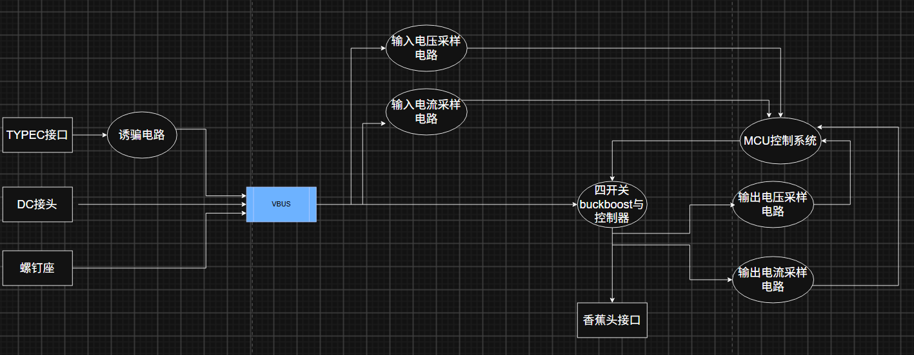
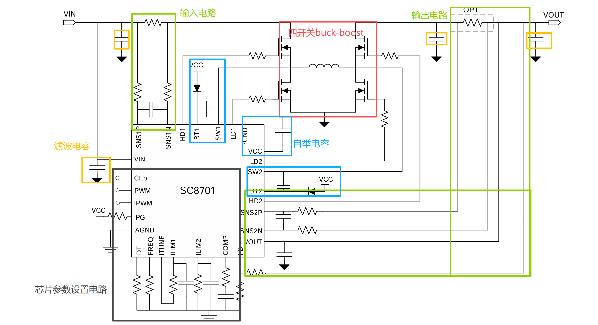
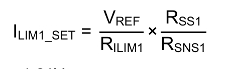
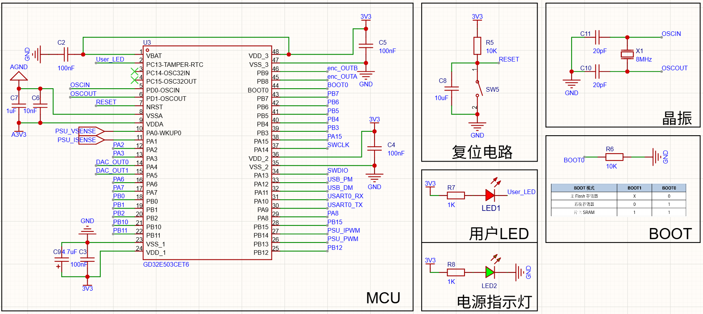

# 一、原创作者
[wanshouxujiu](https://oshwhub.com/wanshouxujiu?jspm=hub.gc.yh.zy___hub.ss.lb.gc30&jlc_vid=TgVYBgFTFFMIVlFQRARdVQFWR1BfUFRUQlALUgIEQgMxVlNeT1ZYXlRfT1BbVjsOAxUeFF5JWA4dDxMOAgNABAsLWBIbFRQLGBUGAhYAAgIFAhZJEA4AAEkAFg8JSgYPFg5DHQwTGUwKDgUIWhgbBgo5GBIGEAwTFU8NCAk%3D)
本项目是对大佬的项目的分析学习。
# 二、器件选型与方案设计分析
## （一）电源树与布局

## （二）主控MCU
原作者的设计采用的是stm32f103c8t6芯片，但是经过我的考量，这个项目是一个不错的可以应用LVGL进行图形化显示的项目，而运行图形库f103的性能显然是不够的。于是看更高级的芯片，包括stm32f4、g4系列。f4系列不是专精做模拟采样的，虽然flash和ram的大小可以。g474倒是有更好的性能，可是太贵了，作为一个学习使用的项目没有必要使用如此昂贵的芯片。纠结之后选择了GD32E503CET6，资源没有stm32g474富裕，但是足够经济，是比较好的用作学习的芯片。
## （三）四开关buckboost芯片
沿用原作者的方案，采用SC8701QDER，
## (四)MCU供电：DCDC降压
使用mp2315s芯片。
# 三、设计分析
## （一）SC8701QDER的外围电路
### 1.电路大体布局

### 2.引脚功能

| 引脚名称  | 描述                                                                                                             | 注意事项                                                                                                                                                                                                                                                                                                            |
| ----- | -------------------------------------------------------------------------------------------------------------- | --------------------------------------------------------------------------------------------------------------------------------------------------------------------------------------------------------------------------------------------------------------------------------------------------------------- |
| /CE   | 芯片使能引脚。当CE=0时芯片启用，默认芯片内部下拉到地。                                                                                  |                                                                                                                                                                                                                                                                                                                 |
| NC    | 无用。                                                                                                            |                                                                                                                                                                                                                                                                                                                 |
| PWM   | 接收方波信号（范围为20k-100k）。通过调整占空比来控制输出电压。当占空比为0%，输出电压为FB引脚设置值的1/6。                                                   | 输出电压范围为预设值的1/6-100%                                                                                                                                                                                                                                                                                             |
| PG    | 电源状态检测引脚。当输出电压在目标电压的附近时引脚状态转变为开漏。                                                                              | 可以外接LED，用作输出电压指示。                                                                                                                                                                                                                                                                                               |
| IPWM  | 与ITURE配合组成电流钳制电路。IPWM负责控制电流的大小。接收方波信号（范围为20k-100k）的占空比影响电流的大小。                                                 | 控制公式：以ILIM1为例，IIN = ILIM1_SET×D                                                                                                                                                                                                                                                                                 |
| ITURE | 与IPWM配合组成电流钳制电路。ITURE负责选中电路是ILIM1、ILIM2。 若需要控制ILIM1的电流限制值，将ILIM1电阻连接在ILIM1引脚和ITUNE引脚之间。通过 ITUNE 引脚只能选择一个电流限制值。 | 如果不需要使用 IPWM 功能，就让 ITUNE 引脚和 IPWM 引脚保持悬空状态，并将 ILIMx 电阻从 ILIMx 引脚连接到 AGND 引脚上。                                                                                                                                                                                                                                   |
| DT    | 死区时间设置。响应时间及其电阻阻值：接地-20ns，68kΩ-40ns，270kΩ-60ns，开路-80ns                                                         | [硬件设计小知识](../../学习/小知识/硬件设计小知识.md)-桥形电路的死区时间                                                                                                                                                                                                                                                                    |
| FREQ  | MOS管开关频率设置。接地-200kHz; 68kΩ-400kHz; 开路-600kHz。                                                                  | （1）在上电时会读取一次FREQ设置的开关频率，此后不再能被修改。    （2）开关频率的设置会影响电感和输出电容的取值、EMC、开关噪声等。                                                                                                                                                                                                                                         |
| ILIM1 | 设置输入电流的限流值。                                                                                                    | 设置公式：                     （1）VREF：内部参考电压，VREF=1.21V。（2）RLIM1 :从ILIMT1到地或者到ITUNE的电阻。（3）Rsns1:电流采用电阻。典型值为 10 mΩ。（4）Rss1：与 SNS1P、SNS1N 相连接的，对Rsns1限流的电阻。这两块电阻器必须相等，推荐值为 1 kΩ。 需要2.2nf的电容与地相连，以消除噪声。如果将IPWM功能应用于ILIM1，则应将电容值改为10nf。如果不需要电流限制功能，将ILIM1短路接地。 |
| ILIM2 | 设置输入电流的限流值。                                                                                                    | 与ILIM1的设计方式相同。                                                                                                                                                                                                                                                                                                  |
| COMP  | 控制回路补偿。是内部误差放大器的输出，用来调校稳压负反馈环路，防止电源振荡，同时控制负载跳变时电压波动大小、恢复快慢。                                                    | 如果需要提升响应速度，可以增大电阻、减小电容。                                                                                                                                                                                                                                                                                         |
| FB    | 输出电压反馈电路。                                                                                                      |            （1）VREF：内部参考电压，VREF=1.21V。                                                                                                                                                                                                                  |
| SNS2N | 与SNS2P组成电流检测放大电路。SNS2N是负端。电流方向：SNS2P-->SNS2N。                                                                  | SNS2N和SNS2P之间需要添加一个电流检测电阻。                                                                                                                                                                                                                                                                                      |
| SNS2P | 与SNS2N组成电流检测放大电路。SNS2P是正端。电流方向：SNS2P-->SNS2N。                                                                  |                                                                                                                                                                                                                                                                                                                 |
| VOUT  | 电压输出端口。                                                                                                        |                                                                                                                                                                                                                                                                                                                 |
| BT2   | 自举电路接口。通过在BT2和HD2之间添加电容实现给高侧MOSFET输出。                                                                          |                                                                                                                                                                                                                                                                                                                 |
| HD2   | 高侧MOSFET门控端。                                                                                                   |                                                                                                                                                                                                                                                                                                                 |
| SW2   | 切换节点2。                                                                                                         |                                                                                                                                                                                                                                                                                                                 |
| LD2   | 低侧MOSFET门控端。                                                                                                   |                                                                                                                                                                                                                                                                                                                 |
| VCC   |                                                                                                                | （1）可为内部门控端提供10v的偏置电压。（2）需要在VCC和PGND间添加1uf的电容。                                                                                                                                                                                                                                                                   |
| PGND  | 电源地。                                                                                                           |                                                                                                                                                                                                                                                                                                                 |
| BT1   |                                                                                                                |                                                                                                                                                                                                                                                                                                                 |
| HD1   |                                                                                                                |                                                                                                                                                                                                                                                                                                                 |
| SW1   |                                                                                                                |                                                                                                                                                                                                                                                                                                                 |
| LD1   |                                                                                                                |                                                                                                                                                                                                                                                                                                                 |
| VIN   | 电压输入端口。                                                                                                        |                                                                                                                                                                                                                                                                                                                 |
| SNS1N |                                                                                                                |                                                                                                                                                                                                                                                                                                                 |
| SNS1P |                                                                                                                |                                                                                                                                                                                                                                                                                                                 |
### 3.典型值设计电路
## （二）gd32系统配置
