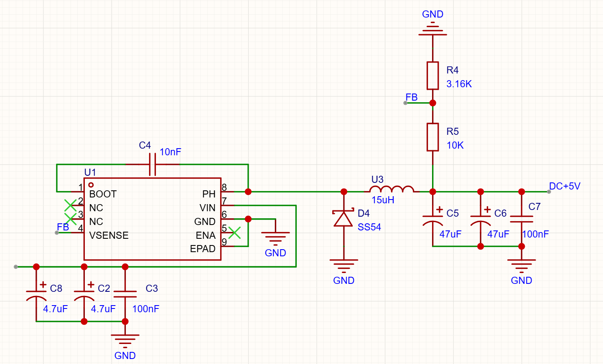

一、目标
- 输入：（1）12V诱骗输入，（2）12VDC接口输入，（3）5Vtypec输入，（4）3-6V不定输入
- 输出：（1）3.3V，（2）5V，（3）12V，（4）24V
- 纹波：<200mV
- 输出电流：>0.5A
- 有带负载能力
二、设计
（1）TYPEC输入
[小知识](../../../学习/PCB与硬件/模块/小知识.md)
（2）buck：12V转5V电路设计
- 使用TPS5450DCDC降压芯片。
- 
- 需要注意的引脚设计：1.ENA：芯片内部有上拉源，如果对ENA引脚悬空，默认就是上拉——使能芯片。2.BOOT：升压引脚，连接自举电容，给PH引脚电压自举。
- 电感的计算：

在本项目的设计中，Vout=5，Vin=12，Iout=3，Fsw=500k，K取0.2，算出Lmin为9.7uH，取1.5倍余量，近似为15uH。
- 对于输入输出滤波电容，在使用时，考虑到我们对纹波比较敏感，因此可以使用多个电容并联，尽可能减少ESR。
- 电容的选值：输入/输出电容越大，输入/输出纹波越小。实际选值需要考虑到成本，以及输出电容过大就会造成过流保护。